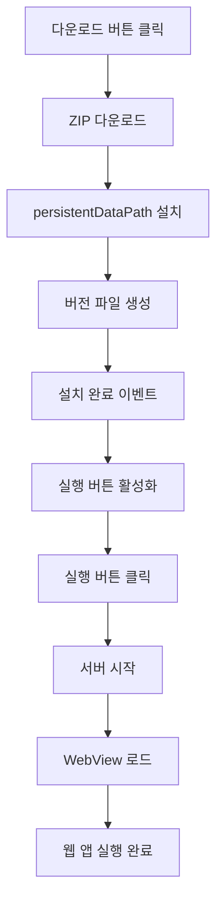
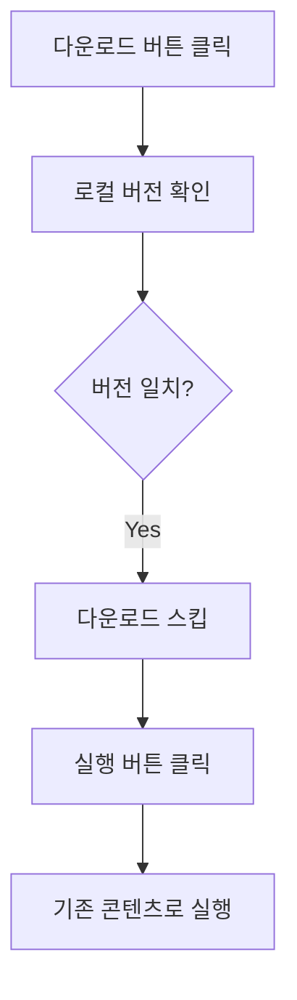
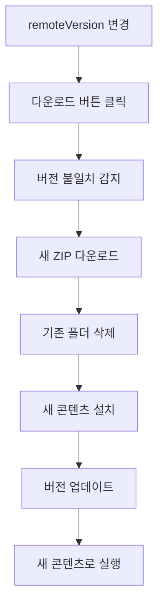

# com.muabe.webview - 아키텍처 문서

## 📦 프로젝트 개요

**Muabe Interactive WebView**는 Unity에서 Flutter/React 웹 앱을 임베드하고, 로컬 HTTP 서버로 콘텐츠를 제공하며, 원격 ZIP 파일로 동적 업데이트를 지원하는 통합 솔루션입니다.

| 항목 | 정보 |
|------|------|
| **버전** | 1.0.3 |
| **Unity 호환** | 2021.3+ |
| **플랫폼** | Android 7.0+, iOS 13+ |
| **네임스페이스** | `Muabe.WebView` |
| **라이선스** | Apache 2.0 |

---

## 🏗️ 프로젝트 구조

```
com.muabe.webview/
├── Runtime/
│   ├── Plugins/                    # 네이티브 플러그인
│   │   ├── Android/
│   │   ├── iOS/
│   │   └── WebView.bundle/
│   └── Scripts/
│       ├── Core/                   # 핵심 시스템
│       │   ├── WebViewConstants.cs      # 상수 정의
│       │   ├── WebViewUtility.cs        # 공통 유틸리티
│       │   └── WebViewButtonBase.cs     # 버튼 베이스 클래스
│       ├── Server/                 # 서버 & 관리
│       │   ├── LocalWebServer.cs
│       │   ├── WebContentDownloadManager.cs
│       │   └── WebViewController.cs
│       ├── UI/                     # UI 컴포넌트
│       │   ├── WebContentDownloadButton.cs
│       │   ├── WebContentLaunchButton.cs
│       │   └── FlutterWidgetButton.cs
│       └── Integration/            # 통합 기능
│           ├── FlutterWebBridge.cs
│           ├── PermissionRequester.cs
│           └── WebViewObject.cs
├── Editor/
│   └── Scripts/
│       ├── WebViewDefines.cs
│       └── UnityWebViewPostprocessBuild.cs
└── Documentation~/
```

---

## 🎯 3-Layer 아키텍처

```
┌─────────────────────────────────────┐
│     UI Layer (사용자 인터페이스)      │
│  - WebContentDownloadButton         │
│  - WebContentLaunchButton           │
│  - FlutterWidgetButton              │
└──────────────┬──────────────────────┘
               │
┌──────────────▼──────────────────────┐
│    Core Layer (핵심 비즈니스 로직)   │
│  - LocalWebServer (HTTP 서버)       │
│  - WebContentDownloadManager        │
│  - WebViewController (WebView 제어) │
│  - FlutterWebBridge (Unity↔Flutter) │
└──────────────┬──────────────────────┘
               │
┌──────────────▼──────────────────────┐
│   Foundation Layer (공통 기능)       │
│  - WebViewConstants (상수)          │
│  - WebViewUtility (유틸리티)        │
│  - WebViewButtonBase (베이스)       │
│  - PermissionRequester (권한)       │
└─────────────────────────────────────┘
```

---

## 🔑 핵심 컴포넌트

### 1. LocalWebServer
**경량 HTTP 서버로 로컬 웹 콘텐츠 제공**

```csharp
using Muabe.WebView;

// 서버 시작
localServer.port = 8082;
localServer.SetRoutePrefix("flutter");
localServer.StartServer();
// → http://localhost:8082/flutter/ 에서 접근
```

**주요 기능**:
- ✅ 멀티스레드 처리 (TcpListener)
- ✅ MIME 타입 자동 감지
- ✅ Android StreamingAssets 캐싱
- ✅ CORS 헤더 자동 추가
- ✅ Path Traversal 공격 방지

**콘텐츠 소스**:
- `PersistentDataPath`: 다운로드된 콘텐츠 (기본)
- `StreamingAssets`: 빌드에 포함된 에셋
- `CustomAbsolute`: 커스텀 경로

---

### 2. WebContentDownloadManager
**원격 ZIP 파일 다운로드, 설치, 버전 관리**

```csharp
// 다운로드 및 설치
manager.SetRemoteVersion("1.0.0");
manager.BeginInstall(false, "https://example.com/app.zip");
```

**워크플로우**:
```
1. ZIP 다운로드 (UnityWebRequest)
   ↓
2. persistentDataPath에 압축 해제
   ↓
3. 버전 파일 생성 (.webcontent-version)
   ↓
4. onInstallCompleted 이벤트 발생
```

**버전 관리**:
- 로컬 버전 vs 원격 버전 비교
- 버전 일치 시 다운로드 스킵
- 강제 다운로드 옵션 지원

**주요 속성**:
- `InstallPath`: 설치 경로
- `ContentRootPath`: 실제 콘텐츠 경로
- `HasInstalledContent()`: 설치 여부 확인

---

### 3. WebViewController
**WebView 생명주기 및 표시 관리**

```csharp
// WebView 초기화 및 로드
controller.serverPort = 8082;
controller.SetWebRootPath("/flutter/");
controller.LoadInitialUrl();
// → http://localhost:8082/flutter/ 로드
```

**주요 기능**:
- ✅ WebView 생명주기 관리
- ✅ Safe Area 자동 감지 및 마진 적용
- ✅ 화면 회전/해상도 변경 대응
- ✅ JavaScript 큐잉 시스템
- ✅ 카메라/마이크 권한 자동 설정

**플랫폼 설정**:
- **iOS**: `enableWKWebView = true` (WKWebView 사용)
- **Android**: 자동 권한 처리

---

### 4. FlutterWebBridge
**Unity ↔ Flutter 양방향 메시지 브리지**

```csharp
// Unity → Flutter 메시지 전송
bridge.ShowWidget("lion");
bridge.HideWidget("cloud");
bridge.ToggleWidgetVisibility("bird");
```

**통신 메커니즘**:

**Unity 측**:
```csharp
bridge.SetWidgetVisibility("lion", false);
// JavaScript 실행: window.__unityBridge.handleMessage({...})
```

**Flutter 측**:
```dart
// 메시지 수신
unityBridge.addVisibilityListener((widgetId, visible) {
  print('$widgetId: $visible');
});
```

---

### 5. UI 컴포넌트

#### WebContentDownloadButton
**ZIP 콘텐츠 다운로드 트리거**

```csharp
[SerializeField] private WebContentDownloadManager installer;
[SerializeField] private string downloadUrl;
[SerializeField] private string remoteVersionOverride;
[SerializeField] private bool forceDownloadEveryTime = false;
```

**기능**:
- 다운로드 진행 상황 표시
- 라벨 커스터마이징 (다운로드 중, 완료, 실패)
- 설치 완료 시 LaunchButton 자동 활성화

#### WebContentLaunchButton
**서버 시작 및 WebView 로드**

```csharp
[SerializeField] private LocalWebServer targetServer;
[SerializeField] private WebViewController targetWebView;
[SerializeField] private string contentRootSubfolder = "flutter";
[SerializeField] private string routePrefix = "flutter";
```

**동작**:
1. 설치된 콘텐츠 확인
2. 서버 경로 설정
3. 서버 시작
4. WebView 로드

#### FlutterWidgetButton
**Flutter 위젯 제어**

```csharp
[SerializeField] private string widgetId;
[SerializeField] private ClickMode clickMode;  // Toggle, Show, Hide

// Unity UI 버튼 영역만큼 WebView 여백 확보
[SerializeField] private bool reserveWebViewArea = false;
```

---

### 6. Foundation Layer

#### WebViewConstants
**모든 상수 통합 관리**

```csharp
public static class WebViewConstants
{
    // 서버
    public const int DefaultServerPort = 8088;
    public const string DefaultDocument = "index.html";
    
    // 타임아웃
    public const float WebViewInitDelay = 0.5f;
    public const float DefaultServerReadyTimeout = 5f;
    
    // 로깅
    public const string LogPrefixServer = "[LocalWebServer]";
    // ... 15+ 상수
}
```

#### WebViewUtility
**15+ 공통 유틸리티 함수**

```csharp
public static class WebViewUtility
{
    // 경로 정규화
    public static string NormalizeRoute(string value);
    public static string NormalizeSubfolder(string value);
    
    // URI/파일 처리
    public static string CombineUri(string baseUri, string relative);
    public static string GetContentType(string filePath);
    
    // Unity 버전 호환 (2022.2+)
    public static T FindObjectInScene<T>(bool includeInactive = true);
    
    // 로깅
    public static void Log(string prefix, string message);
}
```

#### WebViewButtonBase
**버튼 공통 로직**

```csharp
public abstract class WebViewButtonBase : MonoBehaviour
{
    protected Button button;
    protected Text statusText;
    protected Text buttonLabel;
    
    // 자동 UI 참조 할당
    protected virtual void Awake();
    
    // 상태 업데이트
    protected void UpdateStatusLabel(string label);
    protected void SetButtonInteractable(bool value);
    
    // 구현 필수
    protected abstract void OnButtonClicked();
}
```

**장점**: 코드 중복 ~200줄 제거

---

## 🔄 전체 워크플로우

### 시나리오 1: 처음 사용



### 시나리오 2: 재실행 (버전 동일)



### 시나리오 3: 업데이트 (새 버전)



---

## 💡 사용 예시

### 기본 설정 (코드)

```csharp
using Muabe.WebView;

public class WebViewSetup : MonoBehaviour
{
    void Start()
    {
        // 1. GameObject에 컴포넌트 추가
        var manager = gameObject.AddComponent<WebContentDownloadManager>();
        var server = gameObject.AddComponent<LocalWebServer>();
        var controller = gameObject.AddComponent<WebViewController>();
        
        // 2. 기본 설정
        server.port = 8082;
        manager.SetRemoteVersion("1.0.0");
        
        // 3. 콘텐츠 다운로드
        if (!manager.HasInstalledContent())
        {
            manager.BeginInstall(false, "https://example.com/app.zip");
        }
        
        // 4. 서버 시작 및 로드
        server.SetContentRootOverride(manager.ContentRootPath);
        server.SetRoutePrefix("flutter");
        server.StartServer();
        
        controller.SetWebRootPath("/flutter/");
        controller.LoadInitialUrl();
    }
}
```

### Unity ↔ Flutter 통신

**Unity (C#)**:
```csharp
public class GameController : MonoBehaviour
{
    [SerializeField] private FlutterWebBridge bridge;
    
    public void OnLevelComplete()
    {
        // Flutter UI 업데이트
        bridge.ShowWidget("victory");
        bridge.HideWidget("gameplay");
    }
}
```

**Flutter (Dart)**:
```dart
class GamePage extends StatefulWidget {
  @override
  void initState() {
    super.initState();
    
    // Unity 메시지 수신
    unityBridge.addVisibilityListener((widgetId, visible) {
      setState(() {
        if (widgetId == 'victory') {
          showVictoryScreen = visible;
        }
      });
    });
  }
}
```

---

## 🎯 Best Practices

### 1. 경로 일관성 유지

```csharp
// ✅ 권장: 모든 곳에서 동일한 이름 사용
string routeName = "flutter";

server.SetRoutePrefix(routeName);                    // http://localhost:8082/flutter/
manager.SetContentRootSubfolder(routeName);          // /persistentDataPath/.../flutter/
controller.SetWebRootPath("/" + routeName + "/");    // /flutter/
```

### 2. 버전 관리 규칙

```csharp
// ✅ 권장: Semantic Versioning
manager.SetRemoteVersion("1.2.3");

// ❌ 비권장
manager.SetRemoteVersion("latest");   // 모호함
manager.SetRemoteVersion("");         // 빈 값
```

### 3. 에러 핸들링

```csharp
// ✅ 권장: 이벤트 활용
manager.onInstallCompleted.AddListener(() => {
    Debug.Log("설치 완료!");
    launchButton.interactable = true;
});

manager.onInstallFailed.AddListener(() => {
    Debug.LogError("설치 실패");
    ShowRetryDialog();
});
```

### 4. 컴포넌트 구성

```csharp
// ✅ 권장: 하나의 GameObject에 모든 핵심 컴포넌트
GameObject webViewManager = new GameObject("WebViewManager");
webViewManager.AddComponent<LocalWebServer>();
webViewManager.AddComponent<WebContentDownloadManager>();
webViewManager.AddComponent<WebViewController>();
webViewManager.AddComponent<FlutterWebBridge>();
DontDestroyOnLoad(webViewManager);  // 씬 전환 시에도 유지
```

---

## 🔧 플랫폼별 설정

### Android

**자동 설정**:
- `UNITYWEBVIEW_ANDROID_USES_CLEARTEXT_TRAFFIC` define 자동 추가
- AndroidManifest.xml 자동 수정 (cleartext traffic 허용)

**권한 요청**:
```csharp
// PermissionRequester 추가
var permissionRequester = gameObject.AddComponent<PermissionRequester>();
// Start 시 자동으로 카메라/마이크 권한 요청
```

### iOS

**WebView 설정**:
```csharp
// WKWebView 사용 (권장)
controller.enableWKWebView = true;
```

**HTTP 콘텐츠 허용**:
```
Edit > Project Settings > Player > iOS > Other Settings > Configuration
→ Allow downloads over HTTP: Always allowed
```

---

## 📚 참고 자료

### 관련 프로젝트
- **gree/unity-webview**: https://github.com/gree/unity-webview

### 문서
- **README.md**: 사용자 가이드 및 빠른 시작
- **Documentation~/setup.md**: 단계별 설치 가이드
- **ARCHITECTURE.md**: 이 문서

---

## 🚀 빠른 시작

### 1. 패키지 설치

```json
// Packages/manifest.json
{
  "dependencies": {
    "com.muabe.webview": "https://github.com/Muabe-motion/com.muabe.webview.git#Release-1.0.3"
  }
}
```

### 2. 씬 설정

1. **GameObject 생성**: "WebViewManager"
2. **컴포넌트 추가**:
   - LocalWebServer
   - WebContentDownloadManager
   - WebViewController
   - FlutterWebBridge (선택)
3. **UI 버튼 생성**:
   - WebContentDownloadButton
   - WebContentLaunchButton
4. **참조 연결**: Inspector에서 컴포넌트 연결 (대부분 자동)

### 3. Flutter/React 앱 준비

```bash
# Flutter 빌드
flutter build web

# ZIP 압축 (폴더명 = contentRootSubfolder)
cd build
mv web flutter
zip -r flutter-app.zip flutter/

# 서버 업로드 → downloadUrl에 URL 입력
```

---

**문서 버전**: 1.0.3  
**최종 업데이트**: 2025
