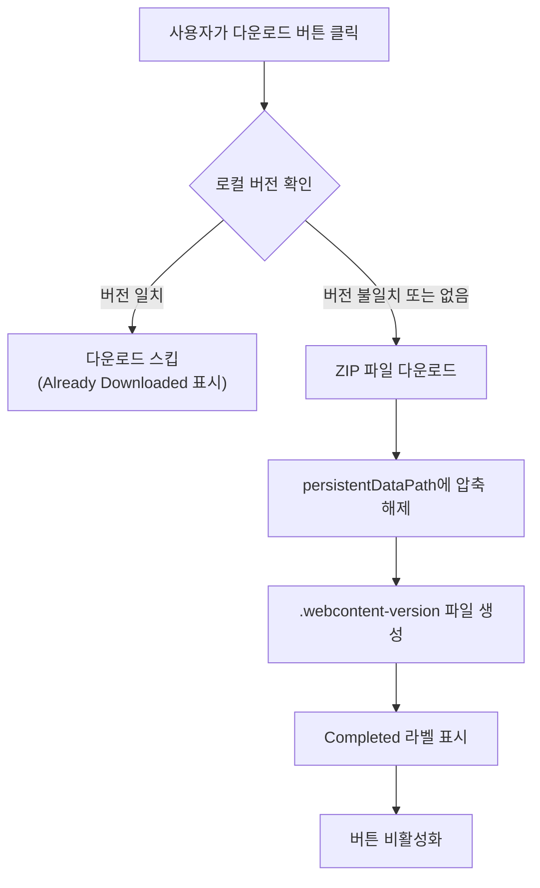
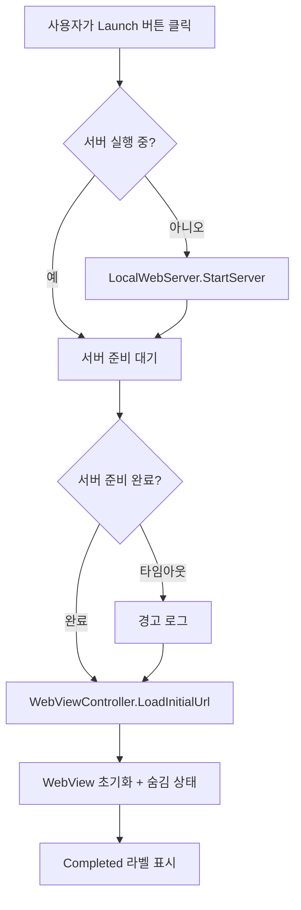
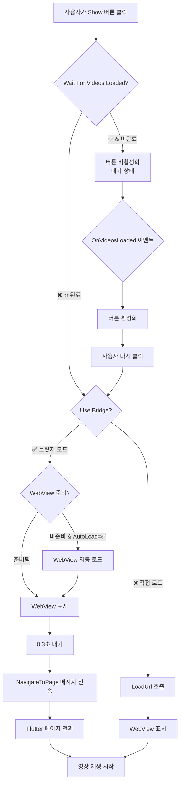
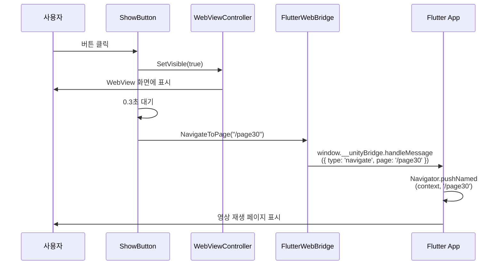

# com.muabe.webview 설정 가이드

## 개요

본 문서는 `com.muabe.webview` 패키지를 사용하여 Unity 프로젝트에서 웹 콘텐츠를
다운로드하고, 웹뷰를 실행하며, 콘텐츠를 재생하는 전체 워크플로우를 설명합니다.

**전체 흐름**: WebView GameObject 설정 → 다운로드(선택) → 웹뷰 런치 → 웹뷰 표시
및 콘텐츠 재생

> **💡 참고**: 다운로드 단계는 선택사항입니다. Unity 앱 내에서 직접 콘텐츠를
> 다운로드해야 하는 경우에만 사용하세요.

---

## 1단계: WebView GameObject 설정

### 1.1 개요

WebView 기능을 사용하기 위한 핵심 GameObject와 컴포넌트를 설정하는 단계입니다.
이 GameObject는 모든 WebView 관련 기능의 중심이 됩니다.

### 1.2 GameObject 생성

```
Hierarchy > Create Empty GameObject
이름: "WebViewManager"
```

### 1.3 필수 컴포넌트 추가

다음 4개의 컴포넌트를 순서대로 추가합니다:

```
Add Component > Muabe.WebView.LocalWebServer
Add Component > Muabe.WebView.WebContentDownloadManager
Add Component > Muabe.WebView.WebViewController
Add Component > Muabe.WebView.FlutterWebBridge
```

### 1.4 각 컴포넌트 설정

#### 1.4.1 LocalWebServer 컴포넌트

로컬 HTTP 서버를 구성합니다.

**필수 설정:**

- **Port**: `8088` (사용할 서버 포트 번호)
- **Default Document**: `index.html` (루트가 될 HTML 파일 이름)
- **Content Path**: `arpedia/dino/wj_demo` (Default Document(index.html)가 있는
  경로, persistentDataPath 기준)

**Inspector 설정:**

```
┌─ Local Web Server (Script) ──────────┐
│ Port: 8088                            │
│ Auto Start On Start: ❌               │
│ Default Document: index.html          │
│ Log Requests: ❌                      │
│ Content Path: arpedia/dino/wj_demo    │
│ Android Preload List File:            │
│ Android Preload List Comment Char: #  │
└───────────────────────────────────────┘
```

> **💡 참고**: Port 번호는 8088을 권장하지만, 다른 번호 사용 시
> WebViewController에서도 동일하게 설정해야 합니다.
>
> **Content Path 설정**:
>
> - persistentDataPath를 기준으로 한 상대 경로입니다
> - 예: `arpedia/dino/wj_demo`로 설정하면 실제 경로는
>   `{persistentDataPath}/arpedia/dino/wj_demo`
> - WebContentDownloadManager의 Install Folder Path와 일치하도록 설정해야 합니다
> - 절대 경로도 지원합니다 (개발 환경에서 유용)

#### 1.4.2 WebContentDownloadManager 컴포넌트 (선택사항)

다운로드한 콘텐츠를 관리합니다.

> **💡 선택사항**: 이 컴포넌트는 Unity 앱 내에서 직접 ZIP 파일을 다운로드하여
> 설치해야 하는 경우에만 필요합니다. 다른 방식(예: 수동 파일 복사, 외부 다운로드
> 도구, 빌드에 포함)으로 콘텐츠를 제공하는 경우 이 컴포넌트를 추가하지 않아도
> 됩니다.

**설정 (사용하는 경우):**

- **Install Folder Path**: `arpedia/dino` (다운로드한 콘텐츠 저장 경로,
  persistentDataPath 기준)
- **Clear Folder Before Install**: ✅ (체크)

**Inspector 설정:**

```
┌─ Web Content Download Manager (Script) ─┐
│ Install Folder Path: arpedia/dino        │
│ Version File Name: .webcontent-version   │
│ Install On Start: ❌                     │
│ Clear Folder Before Install: ✅          │
│                                           │
│ ▼ Events                                 │
│   On Install Started ()                  │
│   On Install Completed ()                │
│   On Install Failed ()                   │
│   On Download Progress (Single)          │
└──────────────────────────────────────────┘
```

> **💡 참고**: `Clear Folder Before Install`을 체크하면 새 버전 설치 시 기존
> 폴더를 먼저 삭제하여 충돌을 방지합니다.
>
> **경로 설정**: `Install Folder Path`는 persistentDataPath를 기준으로 한 상대
> 경로입니다. 예를 들어 `arpedia/dino`로 설정하면 실제 경로는
> `{persistentDataPath}/arpedia/dino`가 됩니다.

#### 1.4.3 WebViewController 컴포넌트

WebView를 제어합니다.

**필수 설정:**

- **Server Port**: `8088` (LocalWebServer의 Port와 동일한 번호)
- **Web Root Path**: `/` (웹 루트 경로, 기본값 `/`)
- **Enable WKWebView**: ✅ (체크, iOS용)
- **Transparent**: 웹뷰의 배경을 투명하게 처리 할 것인지 설정
- **Ignore Safe Area**: 웹뷰가 Safe Area 영역을 무시할지 설정

**Inspector 설정:**

```
┌─ Web View Controller (Script) ───────────┐
│ ▼ Local HTTP Server                      │
│   Server Port: 8088                      │
│   Web Root Path: /                       │
│                                          │
│ ▼ WebView                                │
│   Auto Load On Start: ❌                 │
│   Enable WKWebView: ✅                   │
│   Transparent: ✅                        │
│   Ignore Safe Area: ❌                   │
│                                          │
│ ▼ Overlay Margins (px)                   │
│   Overlay Padding Left: 0                │
│   Overlay Padding Top: 0                 │
│   Overlay Padding Right: 0               │
│   Overlay Padding Bottom: 0              │
└──────────────────────────────────────────┘
```

> **⚠️ 중요**: `Server Port`는 반드시 LocalWebServer의 Port와 동일해야 합니다!
>
> **Web Root Path 설정**:
>
> - 기본값은 `/`입니다 (대부분의 경우 변경 불필요)
> - 웹 콘텐츠가 하위 폴더에 있는 경우 경로 지정 (예: `/flutter/`)
> - 최종 URL: `http://localhost:8088{webRootPath}` (예:
>   `http://localhost:8088/`)

#### 1.4.4 FlutterWebBridge 컴포넌트

Unity와 Flutter 간 양방향 통신을 담당합니다.

**필수 설정:**

- **Unity To Flutter Event**: `__unityBridge` (브릿지 이름)

**Inspector 설정:**

```
┌─ Flutter Web Bridge (Script) ────────────┐
│ Target Web View: (자동 할당됨)              │
│ Unity To Flutter Event: __unityBridge    │
│ Enable Debug Logs: ✅                    │
│                                          │
│ ▼ Events                                 │
│   On Videos Loaded (Int32, Int32)        │
└──────────────────────────────────────────┘
```

> **💡 참고**: `__unityBridge`는 Flutter 측에서 사용할 JavaScript 객체
> 이름입니다. Flutter 앱에서 `window.__unityBridge.handleMessage()`로 메시지를
> 수신합니다.

### 1.5 설정 검증

모든 설정이 올바르게 되었는지 확인합니다:

**체크리스트:**

- [ ] LocalWebServer의 Port: `8088`
- [ ] LocalWebServer의 Default Document: `index.html`
- [ ] LocalWebServer의 Content Path: `arpedia/dino/wj_demo`
- [ ] WebContentDownloadManager의 Install Folder Path: `arpedia/dino`
- [ ] WebContentDownloadManager의 Clear Folder Before Install: ✅
- [ ] WebViewController의 Server Port: `8088` (LocalWebServer와 동일)
- [ ] WebViewController의 Web Root Path: `/` (기본값)
- [ ] WebViewController의 Enable WKWebView: ✅
- [ ] FlutterWebBridge의 Unity To Flutter Event: `__unityBridge`

### 1.6 GameObject 영구 유지 (선택)

씬 전환 시에도 WebView를 유지하려면 스크립트를 추가합니다:

```csharp
using UnityEngine;

public class DontDestroyWebView : MonoBehaviour
{
    void Awake()
    {
        DontDestroyOnLoad(gameObject);
    }
}
```

WebViewManager GameObject에 위 스크립트를 추가하면 씬이 변경되어도 WebView
상태가 유지됩니다.

### 1.7 최종 구조

완성된 GameObject 구조:

```
WebViewManager
├─ LocalWebServer
│  ├─ Port: 8088
│  ├─ Default Document: index.html
│  └─ Content Path: arpedia/dino/wj_demo
├─ WebContentDownloadManager
│  ├─ Install Folder Path: arpedia/dino
│  └─ Clear Folder Before Install: ✅
├─ WebViewController
│  ├─ Server Port: 8088
│  ├─ Web Root Path: /
│  └─ Enable WKWebView: ✅
├─ FlutterWebBridge
│  └─ Unity To Flutter Event: __unityBridge
└─ DontDestroyWebView (선택)
```

---

## 2단계: Download 버튼 설정 (선택사항)

### 2.1 개요

웹 콘텐츠(Flutter/React 앱)를 ZIP 파일로 다운로드하기 위한 UI 버튼을 설정하는
단계입니다.

> **💡 선택사항**: 이 단계는 Unity 앱 내에서 직접 웹 콘텐츠를 다운로드해야 하는
> 경우에만 필요합니다. 다음과 같은 경우에는 이 단계를 건너뛸 수 있습니다:
>
> - 콘텐츠 파일을 수동으로 기기에 복사하는 경우
> - 콘텐츠를 Unity 빌드에 포함시키는 경우 (StreamingAssets 등)
> - 외부 다운로드 매니저나 다른 방식으로 파일을 제공하는 경우
> - 개발 중 로컬 파일 시스템의 절대 경로를 사용하는 경우
>
> 이 단계를 건너뛰는 경우, 3단계부터 시작하면 됩니다.

### 2.2 UI 버튼 생성

```
Hierarchy > UI > Button - TextMeshPro
이름: "DownloadButton"
```

> **💡 참고**: Canvas가 없다면 자동으로 생성됩니다.

### 2.3 컴포넌트 추가

생성한 DownloadButton에 다운로드 기능을 추가합니다:

```
DownloadButton 선택 > Inspector > Add Component > Muabe.WebView.WebContentDownloadButton
```

### 2.4 Inspector 설정

#### WebContentDownloadButton 컴포넌트

**필수 설정:**

1. **Installer**: 1단계에서 생성한 `WebViewManager` GameObject를 드래그 앤 드롭
   - WebViewManager의 `WebContentDownloadManager` 컴포넌트가 자동으로 연결됩니다

2. **Download Url**: 다운로드할 ZIP 파일의 URL 입력
   - 예시: `https://example.com/flutter-app.zip`
   - 또는 CDN 주소: `https://cdn.yourserver.com/releases/app-v1.0.0.zip`

3. **Remote Version Override**: 다운로드할 콘텐츠의 버전 입력
   - 예시: `1.0.0`
   - **⚠️ 중요**: 새로운 버전이 배포되면 이 값을 변경해야 합니다 (예: `1.0.1`)

**Inspector 설정 예시:**

```
┌─ Web Content Download Button (Script) ───┐
│ Installer: WebViewManager                │
│ Launch Button: (비워둠)                    │
│                                          │
│ ▼ 다운로드 입력                             │
│   Download Url:                          │
│   https://example.com/flutter-app.zip    │
│                                          │
│   Remote Version Override: 1.0.0         │
│                                           │
│ ▼ 라벨 설정                               │
│   Downloading Label: 다운로드 중...       │
│   Completed Label: 다운로드 완료          │
│   Failed Label: 다운로드 실패             │
│   Already Downloaded Label: 이미 다운로드됨│
│   Cached Label: 캐시에서 불러오는 중...   │
│                                           │
│ ▼ 옵션                                    │
│   Force Download Every Time: ❌          │
│                                           │
│ ▼ 이벤트                                  │
│   On Download Started ()                 │
│   On Download Completed ()               │
│   On Download Failed ()                  │
└──────────────────────────────────────────┘
```

### 2.5 설정 검증

**체크리스트:**

- [ ] DownloadButton에 `WebContentDownloadButton` 컴포넌트가 추가되었는지 확인
- [ ] `Installer` 필드에 `WebViewManager` GameObject가 할당되었는지 확인
- [ ] `Download Url`에 유효한 ZIP 파일 URL이 입력되었는지 확인
- [ ] `Remote Version Override`에 버전 번호가 입력되었는지 확인 (예: `1.0.0`)

### 2.6 버전 관리 방법

#### 새 버전 배포 시

1. 새로운 콘텐츠를 빌드하고 ZIP으로 압축
2. 서버에 업로드 (URL은 동일하게 유지하거나 새 URL 사용)
3. Unity로 돌아가서 `Remote Version Override` 값 변경
   - 예: `1.0.0` → `1.0.1`
4. 사용자가 다운로드 버튼을 클릭하면 새 버전 자동 다운로드

**버전 비교 로직:**

- 로컬 버전(`persistentDataPath/.webcontent-version` 파일)과 Remote Version
  Override를 비교
- 버전이 다르면 → 새로 다운로드
- 버전이 같으면 → 다운로드 스킵 (이미 다운로드됨)

### 2.7 동작 흐름



### 2.8 테스트

1. Unity Editor에서 Play 모드 실행
2. DownloadButton 클릭
3. Console에서 로그 확인:
   ```
   [WebContentDownloadManager] Downloading from https://example.com/...
   [WebContentDownloadManager] Installation finished. Extracted files to ...
   ```
4. 다운로드 완료 후 버튼에 "다운로드 완료" 또는 "이미 다운로드됨" 표시 확인

### 2.9 트러블슈팅

**문제: "다운로드 실패" 표시**

- **원인**: 잘못된 URL, 네트워크 에러, 파일 없음
- **해결**:
  1. Download Url이 정확한지 확인
  2. 브라우저에서 URL 직접 접속하여 파일 다운로드 테스트
  3. HTTPS URL 사용 권장 (HTTP는 플랫폼 설정 필요)

**문제: 버튼이 계속 "이미 다운로드됨" 상태**

- **원인**: 로컬 버전과 Remote Version이 동일
- **해결**:
  1. `Remote Version Override` 값을 변경 (예: `1.0.0` → `1.0.1`)
  2. 또는 `Force Download Every Time` 체크
  3. 또는 수동으로 폴더 삭제: `Application.persistentDataPath/webview-content/`

**문제: ZIP 구조 오류**

- **원인**: ZIP 내부 폴더 구조가 잘못됨
- **해결**:
  1. ZIP 파일 압축 해제 후 구조 확인
  2. 예상 구조: `flutter-app.zip/flutter/index.html`
  3. `flutter` 폴더가 ZIP 루트에 있어야 함

### 2.10 스크립트에서 직접 호출하기

> **📖 스크립트 전용 가이드**: UI 버튼 없이 스크립트만으로 다운로드를 제어하려면
> **[WEBVIEW_SCRIPT_GUIDE.md](WEBVIEW_SCRIPT_GUIDE.md)** 문서를 참고하세요. 해당
> 문서에서 올바른 타이밍과 대기 로직을 포함한 완전한 예제를 확인할 수 있습니다.

---

## 3단계: 웹서버 실행 및 웹뷰 로드

### 3.1 개요

1단계에서 설정한 LocalWebServer를 시작하고, WebView를 초기화하여 로드하는
단계입니다. LocalWebServer의 Content Path가 이미 설정되어 있어 별도의 경로 설정
없이 바로 서버를 시작할 수 있습니다.

### 3.2 UI 버튼 생성

```
Hierarchy > UI > Button - TextMeshPro
이름: "LaunchButton"
```

### 3.3 컴포넌트 추가

생성한 LaunchButton에 서버 시작 및 웹뷰 로드 기능을 추가합니다:

```
LaunchButton 선택 > Inspector > Add Component > Muabe.WebView.WebContentLaunchButton
```

### 3.4 Inspector 설정

#### WebContentLaunchButton 컴포넌트

**필수 설정:**

1. **Target Server**: 1단계에서 생성한 `WebViewManager` GameObject를 드래그 앤
   드롭
   - WebViewManager의 `LocalWebServer` 컴포넌트가 자동으로 연결됩니다

2. **Target Web View**: 1단계에서 생성한 `WebViewManager` GameObject를 드래그 앤
   드롭
   - WebViewManager의 `WebViewController` 컴포넌트가 자동으로 연결됩니다

**Inspector 설정 예시:**

```
┌─ Web Content Launch Button (Script) ─────┐
│ ▼ 필수 참조                               │
│   Target Server: WebViewManager           │
│   Target Web View: WebViewManager         │
│                                           │
│ ▼ 로드 옵션                               │
│   Start Server If Needed: ✅             │
│   Wait For Server Ready: ✅              │
│   Server Ready Timeout: 5                │
│   Disable Button After Success: ❌       │
│                                           │
│ ▼ 텍스트 설정                             │
│   Loading Label: 로드 중...              │
│   Waiting Server Label: 서버 시작 중...  │
│   Completed Label: 로드 완료             │
│   Failed Label: 로드 실패                │
│                                           │
│ ▼ 이벤트                                  │
│   On Load Started ()                     │
│   On Load Completed ()                   │
│   On Load Failed ()                      │
└──────────────────────────────────────────┘
```

> **💡 참고**: LocalWebServer의 Content Path가 1단계에서 이미 설정되어 있으므로
> 별도의 경로 설정이 필요하지 않습니다.

### 3.5 상세 설정 설명

#### 3.5.1 로드 옵션

**Start Server If Needed** (기본: ✅)

- 서버가 실행 중이 아니면 자동으로 시작합니다
- 체크 해제 시: 서버가 이미 실행 중이어야 합니다

**Wait For Server Ready** (기본: ✅)

- WebView 로드 전에 서버가 완전히 시작될 때까지 대기합니다
- 체크 해제 시: 서버 시작을 기다리지 않고 즉시 WebView 로드 시도

**Server Ready Timeout** (기본: 5초)

- 서버 준비를 기다릴 최대 시간
- 타임아웃 초과 시 경고 로그 출력 후 계속 진행

**Disable Button After Success** (기본: ❌)

- 로드 성공 후 버튼을 비활성화할지 여부
- 체크 시: 한 번만 실행 가능
- 체크 해제 시: 여러 번 클릭 가능 (재로드 용도)

### 3.6 설정 검증

**체크리스트:**

- [ ] LaunchButton에 `WebContentLaunchButton` 컴포넌트가 추가되었는지 확인
- [ ] `Target Server`에 `WebViewManager`가 설정되었는지 확인
- [ ] `Target Web View`에 `WebViewManager`가 설정되었는지 확인
- [ ] 1단계에서 LocalWebServer의 Content Path가 올바르게 설정되었는지 확인

### 3.7 동작 흐름



**주요 단계:**

1. 서버 실행 확인
2. 서버 시작 (`StartServer()`) - Content Path는 1단계에서 이미 설정됨
3. 서버 준비 대기 (최대 5초)
4. WebView URL 로드 (`LoadInitialUrl()`)
5. WebView 초기화 완료 (숨김 상태 유지)

> **⚠️ 중요**: 이 단계에서는 WebView가 **숨김 상태**로 로드됩니다. 실제로 화면에
> 표시되려면 4단계(웹뷰 Show)에서 Show 버튼을 클릭해야 합니다.

### 3.8 테스트

1. Unity Editor에서 Play 모드 실행
2. LaunchButton 클릭
3. Console에서 로그 확인:
   ```
   [WebContentLaunchButton] Starting server...
   [LocalWebServer] Server started on port 8088
   [LocalWebServer] Serving content from: {persistentDataPath}/arpedia/dino/wj_demo
   [WebViewController] Loading URL: http://localhost:8088/
   [WebView] Loaded: http://localhost:8088/
   ```
4. 버튼에 "로드 완료" 표시 확인
5. WebView는 아직 화면에 표시되지 않음 (숨김 상태)

### 3.9 트러블슈팅

**문제: "서버 시작 타임아웃" 경고**

- **원인**: 서버가 5초 내에 준비되지 않음
- **해결**:
  1. `Server Ready Timeout` 값을 10초로 증가
  2. 포트 충돌 확인 (다른 앱이 8088 포트 사용 중)
  3. 1단계 LocalWebServer의 Port 값 확인

**문제: WebView 빈 화면 (404 에러)**

- **원인**: Content Path 설정 오류 또는 파일 구조 오류
- **해결**:
  1. 1단계 LocalWebServer의 Content Path가 올바른지 확인
  2. 실제 파일 경로 확인:
     ```
     {persistentDataPath}/arpedia/dino/wj_demo/
         ├── index.html  ← 이 파일이 있어야 함
         └── ...
     ```
  3. Console에서 서버 로그 확인:
     ```
     [LocalWebServer] File not found on disk: index.html
     ```
  4. LocalWebServer의 Log Requests를 체크하여 상세 로그 확인

**문제: 버튼 클릭해도 반응 없음**

- **원인**: 참조가 올바르게 설정되지 않음
- **해결**:
  1. Inspector에서 Target Server, Target Web View가 모두 할당되었는지 확인
  2. 모두 동일한 `WebViewManager` GameObject를 가리켜야 함
  3. Console에서 에러 로그 확인

### 3.10 스크립트에서 직접 호출하기

> **📖 스크립트 전용 가이드**: UI 버튼 없이 스크립트만으로 서버 시작 및 WebView
> 로드를 제어하려면 **[WEBVIEW_SCRIPT_GUIDE.md](WEBVIEW_SCRIPT_GUIDE.md)**
> 문서를 참고하세요.
>
> **⚠️ 중요**: 스크립트 직접 호출 시 타이밍 문제가 발생할 수 있습니다. 특히
> `LoadInitialUrl()` 호출 직후 "완료" 로그를 출력하면 안 됩니다. WebView가
> 실제로 준비되려면 시간이 걸리므로 반드시 `IsWebViewReady` 속성으로 준비 상태를
> 확인해야 합니다.

---

## 4단계: 웹뷰 Show 및 영상 재생

### 4.1 개요

WebView를 화면에 표시하고 Flutter 앱의 특정 페이지로 이동하여 콘텐츠를 재생하는
단계입니다.

> **💡 목적**: 사용자에게 WebView를 표시하고 지정한 페이지로 이동하여 콘텐츠
> 재생

### 4.2 UI 버튼 생성

```
Hierarchy > UI > Button - TextMeshPro
이름: "ShowButton"
```

### 4.3 컴포넌트 추가

생성한 ShowButton에 웹뷰 표시 및 페이지 이동 기능을 추가합니다:

```
ShowButton 선택 > Inspector > Add Component > Muabe.WebView.WebViewShowButton
```

### 4.4 Inspector 설정

#### WebViewShowButton 컴포넌트

**필수 설정:**

1. **Target Web View**: 1단계에서 생성한 `WebViewManager` GameObject를 드래그 앤
   드롭
   - WebViewManager의 `WebViewController` 컴포넌트가 자동으로 연결됩니다
   - WebView를 화면에 표시하는 데 사용

2. **Bridge**: 1단계에서 생성한 `WebViewManager` GameObject를 드래그 앤 드롭
   - WebViewManager의 `FlutterWebBridge` 컴포넌트가 자동으로 연결됩니다
   - Flutter 페이지 전환 명령을 전송하는 데 사용

3. **Page Path**: 보여줄 페이지의 경로 입력
   - 예시: `page30` 또는 `/page30`
   - Flutter 앱의 라우트 이름과 일치해야 합니다
   - 영상 재생 페이지의 경로를 입력

**Inspector 설정 예시:**

```
┌─ Web View Show Button (Script) ──────────┐
│ ▼ 필수 참조                               │
│   Target Web View: WebViewManager         │
│   Bridge: WebViewManager                  │
│                                           │
│ ▼ 페이지 설정                             │
│   Page Path: page30                      │
│   Use Bridge: ✅                         │
│   Auto Load Web View If Needed: ✅       │
│   Bridge Message Delay: 0.3              │
│                                           │
│ ▼ 직접 로드 모드 옵션                     │
│   Url Path: /                            │
│                                           │
│ ▼ 표시 옵션                               │
│   Show Web View: ✅                      │
│   Load Url: ❌                           │
│                                           │
│ ▼ Videos Loaded 체크                     │
│   Wait For Videos Loaded: ✅             │
│                                           │
│ ▼ 텍스트 설정                             │
│   Loading Label: 로딩 중...              │
│   Completed Label: 로드 완료             │
│   Waiting Videos Label: 비디오 로딩 중... │
│                                           │
│ ▼ 이벤트                                  │
│   On Show Started ()                     │
│   On Show Completed ()                   │
│   On Show Failed ()                      │
└──────────────────────────────────────────┘
```

### 4.5 상세 설정 설명

#### 4.5.1 페이지 설정

**Page Path**

- Flutter 앱에서 정의한 라우트 경로
- 예시:
  - `page30` → Flutter에서 `/page30`으로 해석
  - `/video/player` → 비디오 플레이어 페이지
  - `/gallery` → 갤러리 페이지
- 앞의 `/`는 자동으로 추가되므로 생략 가능
- Flutter 앱의 `routes` 또는 `onGenerateRoute`에 정의된 경로여야 함

**Use Bridge** (기본: ✅, 권장)

- ✅ 체크: 브릿지를 통해 Flutter 페이지 전환 (권장)
  - Flutter의 `Navigator.pushNamed()` 사용
  - 부드러운 페이지 전환 애니메이션
  - Flutter 앱의 상태 유지
- ❌ 체크 해제: 직접 URL 로드 방식
  - `LoadUrl()`로 전체 URL 재로드
  - 페이지 전체가 새로고침됨
  - Flutter 앱 상태 초기화

> **💡 권장**: 대부분의 경우 `Use Bridge = ✅` 사용

**Auto Load Web View If Needed** (기본: ✅)

- WebView가 아직 준비되지 않았을 때 자동으로 로드
- 3단계 LaunchButton을 건너뛴 경우 유용
- 체크 시: WebView 미준비 → 자동 로드 → 페이지 표시
- 체크 해제 시: WebView가 준비되어 있어야 함

**Bridge Message Delay** (기본: 0.3초)

- WebView 표시 후 브릿지 메시지 전송까지 대기 시간
- Flutter 앱이 완전히 준비될 때까지 대기
- 너무 짧으면: Flutter 앱이 메시지를 놓칠 수 있음
- 너무 길면: 사용자 경험 저하
- 권장: 0.3초 ~ 0.5초

#### 4.5.2 직접 로드 모드 옵션 (Use Bridge = ❌일 때만 사용)

**Url Path**

- 직접 로드할 URL 경로
- 예시: `/page30`, `/video/player?id=123`
- `Use Bridge = ❌`일 때만 적용됨

#### 4.5.3 표시 옵션

**Show Web View** (기본: ✅)

- 버튼 클릭 시 WebView를 화면에 표시할지 여부
- ✅ 체크: WebView 보이게 함 (권장)
- ❌ 체크 해제: 페이지만 전환하고 표시하지 않음 (특수 케이스)

**Load Url** (기본: ❌, Use Bridge = ❌일 때만 사용)

- 직접 로드 모드에서 URL을 로드할지 여부
- 브릿지 모드에서는 무시됨

#### 4.5.4 Videos Loaded 체크

**Wait For Videos Loaded** (기본: ✅, 권장)

- 비디오 로드가 완료될 때까지 버튼 비활성화
- ✅ 체크: 비디오 로드 전까지 버튼 비활성화 (권장)
  - 사용자가 비디오가 준비되지 않은 상태에서 페이지를 여는 것을 방지
  - `OnVideosLoaded` 이벤트 발생 시 버튼 자동 활성화
- ❌ 체크 해제: 항상 버튼 활성화
  - 비디오 없이도 페이지 표시 가능
  - 비디오가 아닌 다른 콘텐츠를 보여주는 경우 사용

> **⚠️ 중요**: 영상 재생 페이지로 이동하는 경우 반드시
> `Wait For Videos Loaded = ✅`로 설정

### 4.6 설정 검증

**체크리스트:**

- [ ] ShowButton에 `WebViewShowButton` 컴포넌트가 추가되었는지 확인
- [ ] `Target Web View` 필드에 `WebViewManager`가 할당되었는지 확인
- [ ] `Bridge` 필드에 `WebViewManager`가 할당되었는지 확인
- [ ] `Page Path`에 Flutter 라우트 경로가 입력되었는지 확인 (예: `page30`)
- [ ] `Use Bridge`가 체크되었는지 확인 (권장)
- [ ] `Wait For Videos Loaded`가 체크되었는지 확인 (영상 재생 시 필수)

### 4.7 동작 흐름



**주요 단계 (브릿지 모드):**

1. `Wait For Videos Loaded` 확인 → 비디오 로드 완료 대기
2. `Use Bridge` 확인 → 브릿지 모드 선택
3. `Auto Load Web View If Needed` → WebView 미준비 시 자동 로드
4. `Show Web View` → WebView를 화면에 표시 (숨김 → 보임)
5. `Bridge Message Delay` → 0.3초 대기 (Flutter 앱 준비)
6. `NavigateToPage(pagePath)` → Flutter에 페이지 전환 메시지 전송
7. Flutter에서 `Navigator.pushNamed(context, '/page30')` 실행
8. 영상 재생 페이지로 이동 → 미리 로드된 비디오 즉시 재생

### 4.8 Unity ↔ Flutter 통신 (페이지 전환)

#### 4.8.1 통신 흐름



#### 4.8.2 메시지 형식

**Unity → Flutter (페이지 전환):**

```javascript
// Unity에서 JavaScript 실행
window.__unityBridge.handleMessage({
  type: "navigate",
  page: "/page30",
});
```

**Flutter 측 구현 (참고):**

```dart
class UnityBridge {
  void init() {
    js.context['__unityBridge'] = js.JsObject.jsify({
      'handleMessage': (message) {
        var msg = js.JsObject.jsify(message);
        String type = msg['type'];
        
        if (type == 'navigate') {
          String page = msg['page'];
          navigateToPage(page);
        }
      }
    });
  }
  
  void navigateToPage(String page) {
    // Flutter 네비게이션
    Navigator.pushNamed(navigatorKey.currentContext!, page);
    print('페이지 전환: $page');
  }
}
```

### 4.9 테스트

1. Unity Editor에서 Play 모드 실행
2. DownloadButton 클릭 → 다운로드 완료
3. LaunchButton 클릭 → 웹뷰 로드 완료 (숨김 상태)
4. VideoLoadButton 클릭 → 비디오 로드 완료
5. ShowButton 활성화 확인 (비디오 로드 후 자동 활성화)
6. ShowButton 클릭
7. Console에서 로그 확인:
   ```
   [WebViewShowButton] Showing WebView first...
   [WebViewController] SetVisible(true)
   [WebViewShowButton] Waiting 0.3s for bridge to be ready...
   [WebViewShowButton] Navigating via bridge to: /page30
   [FlutterWebBridge] Sending navigate message: /page30
   [Flutter] 페이지 전환: /page30 (Flutter 로그)
   [WebViewShowButton] Show completed!
   ```
8. 화면 확인:
   - WebView가 화면에 표시됨
   - Flutter 앱의 page30으로 이동
   - 미리 로드된 영상이 즉시 재생됨

### 4.10 트러블슈팅

**문제: 버튼이 계속 비활성화됨**

- **원인**: `Wait For Videos Loaded = ✅`인데 비디오 로드가 완료되지 않음
- **해결**:
  1. 먼저 VideoLoadButton을 클릭하여 비디오 로드
  2. Console에서 "비디오 로드 완료" 로그 확인
  3. 또는 `Wait For Videos Loaded` 체크 해제 (비디오 없이 페이지만 표시)
  4. `bridge.AreVideosLoaded` 속성 확인:
     ```csharp
     Debug.Log($"Videos Loaded: {bridge.AreVideosLoaded}");
     ```

**문제: WebView는 표시되지만 페이지 전환이 안 됨**

- **원인**: Flutter에서 네비게이션 리스너 미구현
- **해결**:
  1. Flutter 앱에서 `__unityBridge.handleMessage` 리스너 확인
  2. `type == 'navigate'` 조건 확인
  3. `Navigator.pushNamed()` 호출 여부 확인
  4. Flutter 콘솔에서 "페이지 전환" 로그 확인
  5. `Bridge Message Delay`를 0.5초로 증가

**문제: "페이지를 찾을 수 없음" 에러 (Flutter)**

- **원인**: Page Path가 Flutter 라우트에 정의되지 않음
- **해결**:
  1. Flutter `MaterialApp`의 `routes` 확인:
     ```dart
     MaterialApp(
       routes: {
         '/page30': (context) => VideoPlayerPage(),
         // Page Path와 일치해야 함
       },
     )
     ```
  2. `Page Path` 값 확인 (예: `page30` → Flutter에서 `/page30`으로 변환)
  3. Flutter 앱에서 라우트가 올바르게 등록되었는지 확인

**문제: WebView가 표시되지 않음**

- **원인**: `Show Web View` 체크 해제 또는 WebView 로드 실패
- **해결**:
  1. `Show Web View` 옵션이 체크되었는지 확인
  2. 3단계 LaunchButton을 먼저 실행했는지 확인
  3. `Auto Load Web View If Needed`를 체크하여 자동 로드 활성화
  4. Console에서 WebView 로드 에러 확인

**문제: 영상이 로딩 중으로 표시됨 (즉시 재생 안 됨)**

- **원인**: 비디오 로드가 완료되지 않음
- **해결**:
  1. `Wait For Videos Loaded = ✅`로 설정하여 비디오 로드 완료 대기
  2. Flutter 앱에서 비디오 프리로드 구현 확인
  3. `OnVideosLoaded` 이벤트가 정상적으로 발생하는지 확인

### 4.11 스크립트에서 직접 호출하기

> **📖 스크립트 전용 가이드**: UI 버튼 없이 스크립트만으로 WebView 표시 및
> 페이지 전환을 제어하려면
> **[WEBVIEW_SCRIPT_GUIDE.md](WEBVIEW_SCRIPT_GUIDE.md)** 문서를 참고하세요.
>
> **⚠️ 중요**: 스크립트 직접 호출 시 다음 사항을 반드시 지켜야 합니다:
>
> - WebView 표시 후 **0.3초 대기**한 뒤 페이지 전환 메시지 전송
> - 비디오 로드가 필요한 경우 `OnVideosLoaded` 이벤트 구독 및 대기
> - WebView 준비 상태 확인 (`IsWebViewReady` 속성)

### 4.12 전체 워크플로우 요약

모든 단계를 순서대로 실행한 최종 결과:

```mermaid
graph LR
    A[1. WebView GameObject 설정] --> B[2. Download 버튼 클릭]
    B --> C[ZIP 다운로드 + 설치]
    C --> D[3. Launch 버튼 클릭]
    D --> E[서버 시작 + WebView 로드<br/>숨김 상태]
    E --> F[4. Video Load 버튼 클릭]
    F --> G[비디오 메모리 로드]
    G --> H[5. Show 버튼 활성화]
    H --> I[사용자 Show 버튼 클릭]
    I --> J[WebView 화면에 표시]
    J --> K[페이지 전환 /page30]
    K --> L[✅ 영상 즉시 재생]
```



**최종 상태:**

- ✅ WebView가 화면에 표시됨
- ✅ Flutter 앱이 영상 재생 페이지(/page30)로 이동
- ✅ 미리 로드된 비디오가 로딩 없이 즉시 재생
- ✅ 사용자는 부드러운 경험을 얻음

---

## 전체 설정 요약

### 단계별 체크리스트

**1단계: WebView GameObject 설정**

- [ ] WebViewManager GameObject 생성
- [ ] LocalWebServer 추가 (Port: 8088, Default Document: index.html, Content
      Path: arpedia/dino/wj_demo)
- [ ] WebContentDownloadManager 추가 (선택사항 - 앱 내 다운로드 기능 사용 시만)
- [ ] WebViewController 추가 (Server Port: 8088, Enable WKWebView: ✅)
- [ ] FlutterWebBridge 추가 (Unity To Flutter Event: __unityBridge)

**2단계: Download 버튼 설정 (선택사항 - 앱 내 다운로드 기능 사용 시만)**

- [ ] DownloadButton 생성
- [ ] WebContentDownloadButton 컴포넌트 추가
- [ ] Installer: WebViewManager 할당
- [ ] Download Url: ZIP 파일 URL 입력
- [ ] Remote Version Override: 버전 입력 (예: 1.0.0)

**3단계: Launch 버튼 설정**

- [ ] LaunchButton 생성
- [ ] WebContentLaunchButton 컴포넌트 추가
- [ ] Installer, Target Server, Target Web View: 모두 WebViewManager 할당
- [ ] Content Root Subfolder: ZIP 폴더명 입력 (예: flutter)
- [ ] Route Prefix: 동일한 폴더명 입력 (예: flutter)

**4단계: Show 버튼 설정**

- [ ] ShowButton 생성
- [ ] WebViewShowButton 컴포넌트 추가
- [ ] Target Web View: WebViewManager 할당
- [ ] Bridge: WebViewManager 할당
- [ ] Page Path: Flutter 페이지 경로 입력 (예: page30)
- [ ] Use Bridge: ✅
- [ ] Wait For Videos Loaded: ✅

### 실행 순서

```
1. DownloadButton 클릭 → 다운로드 완료 대기 (선택사항 - 앱 내 다운로드 사용 시만)
2. LaunchButton 클릭 → 서버 시작 및 WebView 로드 (숨김)
3. ShowButton 클릭 → WebView 표시 및 페이지 이동
```

> **💡 참고**: 2단계(Download)를 건너뛴 경우, 콘텐츠 파일이 이미 올바른 경로에
> 있는지 확인한 후 LaunchButton부터 시작하면 됩니다.

---
