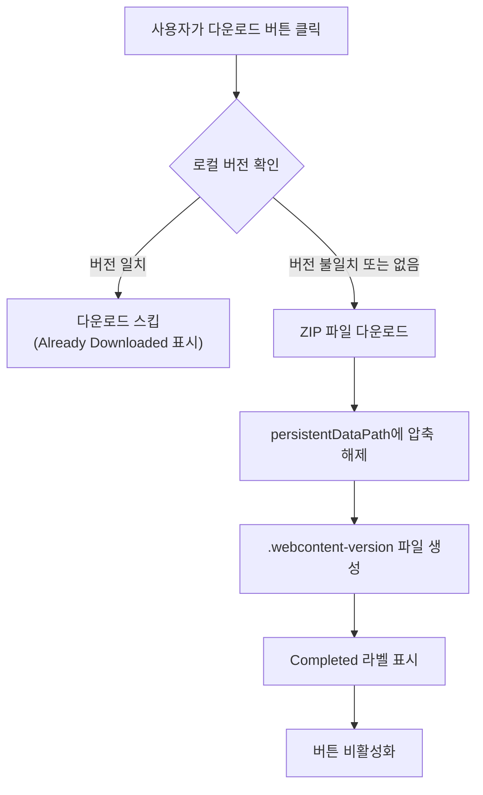
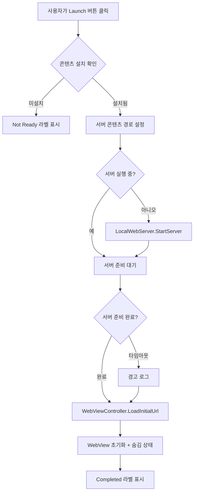
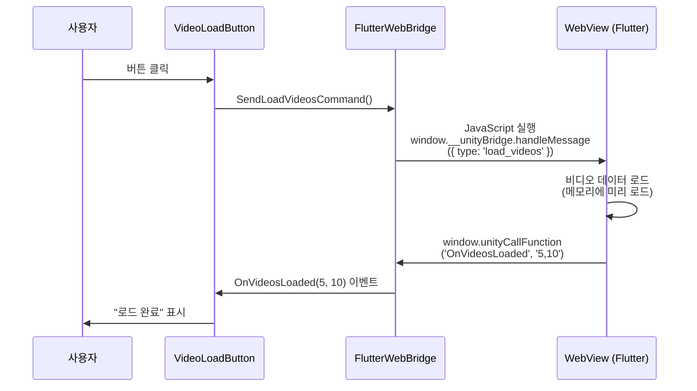
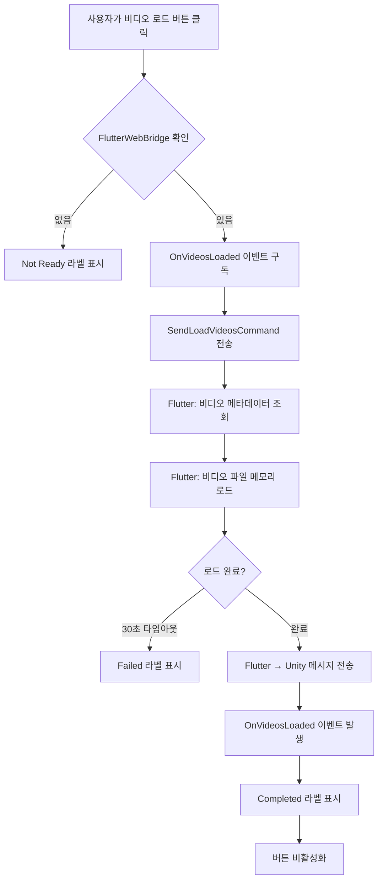
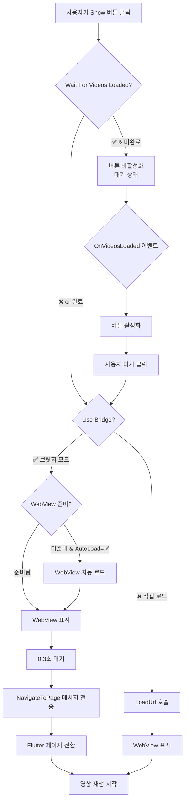
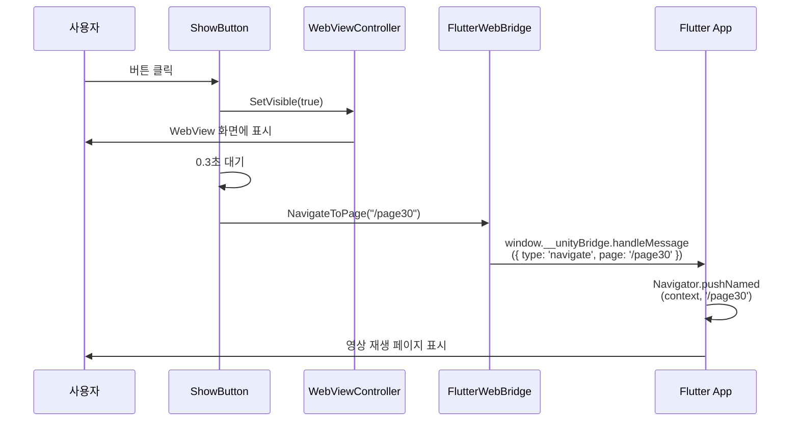

# com.muabe.webview 설정 가이드

## 개요

본 문서는 `com.muabe.webview` 패키지를 사용하여 Unity 프로젝트에서 웹 콘텐츠를 다운로드하고, 웹뷰를 실행하며, 영상을 로드하여 재생하는 전체 워크플로우를 설명합니다.

**전체 흐름**: WebView GameObject 설정 → 다운로드 → 웹뷰 런치 → 영상 로드 → 영상 재생 (웹뷰 표시)

---

## 1단계: WebView GameObject 설정

### 1.1 개요

WebView 기능을 사용하기 위한 핵심 GameObject와 컴포넌트를 설정하는 단계입니다. 이 GameObject는 모든 WebView 관련 기능의 중심이 됩니다.

### 1.2 GameObject 생성

```
Hierarchy > Create Empty GameObject
이름: "WebViewManager"
```

### 1.3 필수 컴포넌트 추가

다음 4개의 컴포넌트를 순서대로 추가합니다:

```
Add Component > Muabe.WebView.LocalWebServer
Add Component > Muabe.WebView.WebContentDownloadManager
Add Component > Muabe.WebView.WebViewController
Add Component > Muabe.WebView.FlutterWebBridge
```

### 1.4 각 컴포넌트 설정

#### 1.4.1 LocalWebServer 컴포넌트

로컬 HTTP 서버를 구성합니다.

**필수 설정:**
- **Port**: `8088` (사용할 서버 포트 번호)
- **Default Document**: `index.html` (루트가 될 HTML 파일 이름)

**Inspector 설정:**
```
┌─ Local Web Server (Script) ──────────┐
│ Port: 8088                            │
│ Default Document: index.html          │
│ Content Source: PersistentDataPath    │
│ Route Prefix: (비워둠)                │
└───────────────────────────────────────┘
```

> **💡 참고**: Port 번호는 8088을 권장하지만, 다른 번호 사용 시 WebViewController에서도 동일하게 설정해야 합니다.

#### 1.4.2 WebContentDownloadManager 컴포넌트

다운로드한 콘텐츠를 관리합니다.

**필수 설정:**
- **Install Folder Name**: `webview-content` (다운로드한 콘텐츠 저장 폴더 이름)
- **Clear Folder Before Install**: ✅ (체크)

**Inspector 설정:**
```
┌─ Web Content Download Manager (Script) ─┐
│ Install Folder Name: webview-content     │
│ Version File Name: .webcontent-version   │
│ Install On Start: ❌                     │
│ Clear Folder Before Install: ✅          │
│                                           │
│ ▼ Events                                 │
│   On Install Started ()                  │
│   On Install Completed ()                │
│   On Install Failed ()                   │
│   On Download Progress (Single)          │
└──────────────────────────────────────────┘
```

> **💡 참고**: `Clear Folder Before Install`을 체크하면 새 버전 설치 시 기존 폴더를 먼저 삭제하여 충돌을 방지합니다.

#### 1.4.3 WebViewController 컴포넌트

WebView를 제어합니다.

**필수 설정:**
- **Server Port**: `8088` (LocalWebServer의 Port와 동일한 번호)
- **Enable WKWebView**: ✅ (체크, iOS용)

**Inspector 설정:**
```
┌─ Web View Controller (Script) ───────────┐
│ ▼ Local HTTP Server                      │
│   Server Port: 8088                       │
│                                           │
│ ▼ WebView                                │
│   Auto Load On Start: ❌                 │
│   Enable WKWebView: ✅                   │
│   Transparent: ✅                        │
│   Ignore Safe Area: ❌                   │
│                                           │
│ ▼ Overlay Margins (px)                   │
│   Overlay Padding Left: 0                │
│   Overlay Padding Top: 0                 │
│   Overlay Padding Right: 0               │
│   Overlay Padding Bottom: 0              │
└──────────────────────────────────────────┘
```

> **⚠️ 중요**: `Server Port`는 반드시 LocalWebServer의 Port와 동일해야 합니다!

#### 1.4.4 FlutterWebBridge 컴포넌트

Unity와 Flutter 간 양방향 통신을 담당합니다.

**필수 설정:**
- **Unity To Flutter Event**: `__unityBridge` (브릿지 이름)

**Inspector 설정:**
```
┌─ Flutter Web Bridge (Script) ────────────┐
│ Target Web View: (자동 할당됨)            │
│ Unity To Flutter Event: __unityBridge    │
│ Enable Debug Logs: ✅                    │
│                                           │
│ ▼ Events                                 │
│   On Videos Loaded (Int32, Int32)        │
└──────────────────────────────────────────┘
```

> **💡 참고**: `__unityBridge`는 Flutter 측에서 사용할 JavaScript 객체 이름입니다. Flutter 앱에서 `window.__unityBridge.handleMessage()`로 메시지를 수신합니다.

### 1.5 설정 검증

모든 설정이 올바르게 되었는지 확인합니다:

**체크리스트:**
- [ ] LocalWebServer의 Port: `8088`
- [ ] LocalWebServer의 Default Document: `index.html`
- [ ] WebContentDownloadManager의 Install Folder Name: `webview-content`
- [ ] WebContentDownloadManager의 Clear Folder Before Install: ✅
- [ ] WebViewController의 Server Port: `8088` (LocalWebServer와 동일)
- [ ] WebViewController의 Enable WKWebView: ✅
- [ ] FlutterWebBridge의 Unity To Flutter Event: `__unityBridge`

### 1.6 GameObject 영구 유지 (선택)

씬 전환 시에도 WebView를 유지하려면 스크립트를 추가합니다:

```csharp
using UnityEngine;

public class DontDestroyWebView : MonoBehaviour
{
    void Awake()
    {
        DontDestroyOnLoad(gameObject);
    }
}
```

WebViewManager GameObject에 위 스크립트를 추가하면 씬이 변경되어도 WebView 상태가 유지됩니다.

### 1.7 최종 구조

완성된 GameObject 구조:

```
WebViewManager
├─ LocalWebServer
│  ├─ Port: 8088
│  └─ Default Document: index.html
├─ WebContentDownloadManager
│  ├─ Install Folder Name: webview-content
│  └─ Clear Folder Before Install: ✅
├─ WebViewController
│  ├─ Server Port: 8088
│  └─ Enable WKWebView: ✅
├─ FlutterWebBridge
│  └─ Unity To Flutter Event: __unityBridge
└─ DontDestroyWebView (선택)
```

---

## 2단계: Download 버튼 설정

### 2.1 개요

웹 콘텐츠(Flutter/React 앱)를 ZIP 파일로 다운로드하기 위한 UI 버튼을 설정하는 단계입니다.

### 2.2 UI 버튼 생성

```
Hierarchy > UI > Button - TextMeshPro
이름: "DownloadButton"
```

> **💡 참고**: Canvas가 없다면 자동으로 생성됩니다.

### 2.3 컴포넌트 추가

생성한 DownloadButton에 다운로드 기능을 추가합니다:

```
DownloadButton 선택 > Inspector > Add Component > Muabe.WebView.WebContentDownloadButton
```

### 2.4 Inspector 설정

#### WebContentDownloadButton 컴포넌트

**필수 설정:**

1. **Installer**: 1단계에서 생성한 `WebViewManager` GameObject를 드래그 앤 드롭
   - WebViewManager의 `WebContentDownloadManager` 컴포넌트가 자동으로 연결됩니다

2. **Download Url**: 다운로드할 ZIP 파일의 URL 입력
   - 예시: `https://example.com/flutter-app.zip`
   - 또는 CDN 주소: `https://cdn.yourserver.com/releases/app-v1.0.0.zip`

3. **Remote Version Override**: 다운로드할 콘텐츠의 버전 입력
   - 예시: `1.0.0`
   - **⚠️ 중요**: 새로운 버전이 배포되면 이 값을 변경해야 합니다 (예: `1.0.1`)

**Inspector 설정 예시:**
```
┌─ Web Content Download Button (Script) ───┐
│ Installer: WebViewManager                 │
│ Launch Button: (비워둠)                   │
│                                           │
│ ▼ 다운로드 입력                           │
│   Download Url:                           │
│   https://example.com/flutter-app.zip     │
│                                           │
│   Remote Version Override: 1.0.0          │
│                                           │
│ ▼ 라벨 설정                               │
│   Downloading Label: 다운로드 중...       │
│   Completed Label: 다운로드 완료          │
│   Failed Label: 다운로드 실패             │
│   Already Downloaded Label: 이미 다운로드됨│
│   Cached Label: 캐시에서 불러오는 중...   │
│                                           │
│ ▼ 옵션                                    │
│   Force Download Every Time: ❌          │
│                                           │
│ ▼ 이벤트                                  │
│   On Download Started ()                 │
│   On Download Completed ()               │
│   On Download Failed ()                  │
└──────────────────────────────────────────┘
```

### 2.5 설정 검증

**체크리스트:**
- [ ] DownloadButton에 `WebContentDownloadButton` 컴포넌트가 추가되었는지 확인
- [ ] `Installer` 필드에 `WebViewManager` GameObject가 할당되었는지 확인
- [ ] `Download Url`에 유효한 ZIP 파일 URL이 입력되었는지 확인
- [ ] `Remote Version Override`에 버전 번호가 입력되었는지 확인 (예: `1.0.0`)

### 2.6 버전 관리 방법

#### 새 버전 배포 시

1. 새로운 콘텐츠를 빌드하고 ZIP으로 압축
2. 서버에 업로드 (URL은 동일하게 유지하거나 새 URL 사용)
3. Unity로 돌아가서 `Remote Version Override` 값 변경
   - 예: `1.0.0` → `1.0.1`
4. 사용자가 다운로드 버튼을 클릭하면 새 버전 자동 다운로드

**버전 비교 로직:**
- 로컬 버전(`persistentDataPath/.webcontent-version` 파일)과 Remote Version Override를 비교
- 버전이 다르면 → 새로 다운로드
- 버전이 같으면 → 다운로드 스킵 (이미 다운로드됨)

### 2.7 동작 흐름



### 2.8 테스트

1. Unity Editor에서 Play 모드 실행
2. DownloadButton 클릭
3. Console에서 로그 확인:
   ```
   [WebContentDownloadManager] Downloading from https://example.com/...
   [WebContentDownloadManager] Installation finished. Extracted files to ...
   ```
4. 다운로드 완료 후 버튼에 "다운로드 완료" 또는 "이미 다운로드됨" 표시 확인

### 2.9 트러블슈팅

**문제: "다운로드 실패" 표시**
- **원인**: 잘못된 URL, 네트워크 에러, 파일 없음
- **해결**:
  1. Download Url이 정확한지 확인
  2. 브라우저에서 URL 직접 접속하여 파일 다운로드 테스트
  3. HTTPS URL 사용 권장 (HTTP는 플랫폼 설정 필요)

**문제: 버튼이 계속 "이미 다운로드됨" 상태**
- **원인**: 로컬 버전과 Remote Version이 동일
- **해결**:
  1. `Remote Version Override` 값을 변경 (예: `1.0.0` → `1.0.1`)
  2. 또는 `Force Download Every Time` 체크
  3. 또는 수동으로 폴더 삭제: `Application.persistentDataPath/webview-content/`

**문제: ZIP 구조 오류**
- **원인**: ZIP 내부 폴더 구조가 잘못됨
- **해결**:
  1. ZIP 파일 압축 해제 후 구조 확인
  2. 예상 구조: `flutter-app.zip/flutter/index.html`
  3. `flutter` 폴더가 ZIP 루트에 있어야 함

### 2.10 스크립트에서 직접 호출하기

UI 버튼 대신 다른 스크립트에서 메서드를 직접 호출하여 다운로드를 실행할 수 있습니다.

#### 2.10.1 기본 사용법

```csharp
using UnityEngine;
using Muabe.WebView;

public class MyDownloadManager : MonoBehaviour
{
    [SerializeField] private WebContentDownloadManager downloadManager;
    
    void Start()
    {
        // WebViewManager에서 컴포넌트 찾기
        if (downloadManager == null)
        {
            GameObject webViewManager = GameObject.Find("WebViewManager");
            downloadManager = webViewManager.GetComponent<WebContentDownloadManager>();
        }
        
        // 다운로드 실행
        StartDownload();
    }
    
    void StartDownload()
    {
        // 1. 버전 설정
        downloadManager.SetRemoteVersion("1.0.0");
        
        // 2. 콘텐츠 루트 폴더 설정 (선택)
        downloadManager.SetContentRootSubfolder("flutter");
        
        // 3. 다운로드 시작
        string downloadUrl = "https://example.com/flutter-app.zip";
        downloadManager.BeginInstall(false, downloadUrl);
    }
}
```

#### 2.10.2 이벤트 구독

다운로드 상태를 추적하려면 이벤트를 구독합니다:

```csharp
using UnityEngine;
using Muabe.WebView;

public class MyDownloadManager : MonoBehaviour
{
    [SerializeField] private WebContentDownloadManager downloadManager;
    
    void Start()
    {
        // 이벤트 구독
        downloadManager.onInstallStarted.AddListener(OnDownloadStarted);
        downloadManager.onInstallCompleted.AddListener(OnDownloadCompleted);
        downloadManager.onInstallFailed.AddListener(OnDownloadFailed);
        downloadManager.onDownloadProgress.AddListener(OnDownloadProgress);
        
        // 다운로드 실행
        StartDownload();
    }
    
    void OnDestroy()
    {
        // 이벤트 구독 해제
        if (downloadManager != null)
        {
            downloadManager.onInstallStarted.RemoveListener(OnDownloadStarted);
            downloadManager.onInstallCompleted.RemoveListener(OnDownloadCompleted);
            downloadManager.onInstallFailed.RemoveListener(OnDownloadFailed);
            downloadManager.onDownloadProgress.RemoveListener(OnDownloadProgress);
        }
    }
    
    void StartDownload()
    {
        downloadManager.SetRemoteVersion("1.0.0");
        downloadManager.BeginInstall(false, "https://example.com/flutter-app.zip");
    }
    
    void OnDownloadStarted()
    {
        Debug.Log("다운로드 시작됨");
        // UI 업데이트: 로딩 스피너 표시 등
    }
    
    void OnDownloadProgress(float progress)
    {
        Debug.Log($"다운로드 진행률: {progress * 100}%");
        // UI 업데이트: 프로그레스 바 갱신
    }
    
    void OnDownloadCompleted()
    {
        Debug.Log("다운로드 완료!");
        // UI 업데이트: 완료 메시지 표시
        // 다음 단계로 진행 (예: 웹뷰 런치)
    }
    
    void OnDownloadFailed()
    {
        Debug.LogError("다운로드 실패!");
        // UI 업데이트: 에러 메시지 표시
        // 재시도 버튼 활성화 등
    }
}
```

#### 2.10.3 조건부 다운로드

이미 다운로드되었는지 확인하고 필요한 경우에만 다운로드:

```csharp
using UnityEngine;
using Muabe.WebView;

public class SmartDownloadManager : MonoBehaviour
{
    [SerializeField] private WebContentDownloadManager downloadManager;
    
    void Start()
    {
        CheckAndDownload("1.0.0", "https://example.com/flutter-app.zip");
    }
    
    void CheckAndDownload(string version, string url)
    {
        // 버전 설정
        downloadManager.SetRemoteVersion(version);
        
        // 이미 다운로드되었는지 확인
        if (downloadManager.HasInstalledContent())
        {
            Debug.Log("콘텐츠가 이미 설치되어 있습니다.");
            // 다음 단계로 바로 진행
            OnContentReady();
        }
        else
        {
            Debug.Log("콘텐츠를 다운로드합니다...");
            // 이벤트 구독
            downloadManager.onInstallCompleted.AddListener(OnContentReady);
            downloadManager.onInstallFailed.AddListener(OnDownloadFailed);
            
            // 다운로드 시작
            downloadManager.BeginInstall(false, url);
        }
    }
    
    void OnContentReady()
    {
        Debug.Log("콘텐츠 준비 완료!");
        downloadManager.onInstallCompleted.RemoveListener(OnContentReady);
        
        // 다음 단계 실행 (예: 웹뷰 런치)
        LaunchWebView();
    }
    
    void OnDownloadFailed()
    {
        Debug.LogError("다운로드 실패. 재시도 필요.");
        downloadManager.onInstallFailed.RemoveListener(OnDownloadFailed);
    }
    
    void LaunchWebView()
    {
        // 3단계로 진행...
    }
}
```

#### 2.10.4 강제 재다운로드

버전에 관계없이 항상 새로 다운로드:

```csharp
void ForceRedownload()
{
    string version = "1.0.1";  // 새 버전
    string url = "https://example.com/flutter-app-v1.0.1.zip";
    
    downloadManager.SetRemoteVersion(version);
    
    // forceRedownload = true로 설정
    downloadManager.BeginInstall(true, url);
    
    Debug.Log("강제 재다운로드 시작...");
}
```

#### 2.10.5 주요 메서드 정리

**WebContentDownloadManager 주요 메서드:**

| 메서드 | 설명 | 예시 |
|--------|------|------|
| `SetRemoteVersion(string)` | 원격 버전 설정 | `SetRemoteVersion("1.0.0")` |
| `SetContentRootSubfolder(string)` | 콘텐츠 폴더명 설정 | `SetContentRootSubfolder("flutter")` |
| `BeginInstall(bool, string)` | 다운로드 시작 | `BeginInstall(false, "https://...")` |
| `HasInstalledContent()` | 설치 여부 확인 | `if (HasInstalledContent()) { ... }` |
| `TryGetInstalledContentRoot(out string)` | 설치 경로 가져오기 | `TryGetInstalledContentRoot(out path)` |

**BeginInstall 매개변수:**
- `forceRedownload` (bool): true면 기존 버전 무시하고 재다운로드
- `overrideDownloadUrl` (string): 다운로드할 ZIP 파일 URL

#### 2.10.6 완전한 예제

자동으로 다운로드 → 완료 시 다음 단계 진행:

```csharp
using System.Collections;
using UnityEngine;
using Muabe.WebView;

public class AutoDownloadAndLaunch : MonoBehaviour
{
    [Header("참조")]
    [SerializeField] private WebContentDownloadManager downloadManager;
    [SerializeField] private LocalWebServer webServer;
    [SerializeField] private WebViewController webViewController;
    
    [Header("설정")]
    [SerializeField] private string contentVersion = "1.0.0";
    [SerializeField] private string downloadUrl = "https://example.com/flutter-app.zip";
    [SerializeField] private string contentFolder = "flutter";
    
    void Start()
    {
        // GameObject 찾기
        if (downloadManager == null)
        {
            GameObject manager = GameObject.Find("WebViewManager");
            downloadManager = manager.GetComponent<WebContentDownloadManager>();
            webServer = manager.GetComponent<LocalWebServer>();
            webViewController = manager.GetComponent<WebViewController>();
        }
        
        // 자동 실행
        StartCoroutine(AutoSetupWorkflow());
    }
    
    IEnumerator AutoSetupWorkflow()
    {
        // 1단계: 다운로드
        yield return StartCoroutine(DownloadContent());
        
        // 2단계: 서버 시작
        yield return StartCoroutine(StartServer());
        
        // 3단계: 웹뷰 로드
        LoadWebView();
        
        Debug.Log("모든 설정 완료!");
    }
    
    IEnumerator DownloadContent()
    {
        Debug.Log("=== 1단계: 콘텐츠 다운로드 ===");
        
        downloadManager.SetRemoteVersion(contentVersion);
        downloadManager.SetContentRootSubfolder(contentFolder);
        
        if (downloadManager.HasInstalledContent())
        {
            Debug.Log("콘텐츠가 이미 설치되어 있습니다. 다운로드 스킵.");
            yield break;
        }
        
        bool downloadComplete = false;
        bool downloadFailed = false;
        
        downloadManager.onInstallCompleted.AddListener(() => downloadComplete = true);
        downloadManager.onInstallFailed.AddListener(() => downloadFailed = true);
        
        downloadManager.BeginInstall(false, downloadUrl);
        
        // 완료 대기
        while (!downloadComplete && !downloadFailed)
        {
            yield return null;
        }
        
        if (downloadFailed)
        {
            Debug.LogError("다운로드 실패!");
            yield break;
        }
        
        Debug.Log("다운로드 완료!");
    }
    
    IEnumerator StartServer()
    {
        Debug.Log("=== 2단계: 서버 시작 ===");
        
        webServer.SetContentRootOverride(downloadManager.ContentRootPath);
        webServer.SetRoutePrefix(contentFolder);
        webServer.StartServer();
        
        // 서버 준비 대기
        float timeout = 5f;
        while (!webServer.IsRunning && timeout > 0)
        {
            yield return new WaitForSeconds(0.1f);
            timeout -= 0.1f;
        }
        
        if (webServer.IsRunning)
        {
            Debug.Log("서버 시작 완료!");
        }
        else
        {
            Debug.LogWarning("서버 시작 타임아웃");
        }
    }
    
    void LoadWebView()
    {
        Debug.Log("=== 3단계: 웹뷰 로드 ===");
        
        webViewController.SetWebRootPath($"/{contentFolder}/");
        webViewController.LoadInitialUrl();
        
        Debug.Log("웹뷰 로드 시작!");
    }
}
```

> **💡 팁**: 위 스크립트를 WebViewManager GameObject에 추가하면 씬 시작 시 자동으로 다운로드 → 서버 시작 → 웹뷰 로드가 순차적으로 실행됩니다.

---

## 3단계: 웹서버 실행 및 웹뷰 로드

### 3.1 개요

2단계에서 다운로드한 콘텐츠를 로컬 HTTP 서버로 서비스하고, WebView를 초기화하여 로드하는 단계입니다.

### 3.2 UI 버튼 생성

```
Hierarchy > UI > Button - TextMeshPro
이름: "LaunchButton"
```

### 3.3 컴포넌트 추가

생성한 LaunchButton에 서버 시작 및 웹뷰 로드 기능을 추가합니다:

```
LaunchButton 선택 > Inspector > Add Component > Muabe.WebView.WebContentLaunchButton
```

### 3.4 Inspector 설정

#### WebContentLaunchButton 컴포넌트

**필수 설정:**

1. **Installer**: 1단계에서 생성한 `WebViewManager` GameObject를 드래그 앤 드롭
   - WebViewManager의 `WebContentDownloadManager` 컴포넌트가 자동으로 연결됩니다

2. **Target Server**: 1단계에서 생성한 `WebViewManager` GameObject를 드래그 앤 드롭
   - WebViewManager의 `LocalWebServer` 컴포넌트가 자동으로 연결됩니다

3. **Target Web View**: 1단계에서 생성한 `WebViewManager` GameObject를 드래그 앤 드롭
   - WebViewManager의 `WebViewController` 컴포넌트가 자동으로 연결됩니다

4. **Content Root Subfolder**: ZIP 파일 압축 시 사용한 폴더 이름 입력
   - 예시: `flutter`
   - ⚠️ 2단계의 ZIP 파일 구조와 일치해야 합니다
   - 예: `flutter-app.zip` → 내부에 `flutter` 폴더 → `flutter/index.html`

5. **Route Prefix**: 서버 URL 경로에 사용할 프리픽스 입력
   - 예시: `flutter`
   - Content Root Subfolder와 동일하게 설정하는 것을 권장
   - 최종 URL: `http://localhost:8088/flutter/`

**Inspector 설정 예시:**
```
┌─ Web Content Launch Button (Script) ─────┐
│ ▼ 필수 참조                               │
│   Installer: WebViewManager               │
│   Target Server: WebViewManager           │
│   Target Web View: WebViewManager         │
│                                           │
│ ▼ 경로 입력                               │
│   Content Root Subfolder: flutter        │
│   Route Prefix: flutter                  │
│                                           │
│ ▼ 로드 옵션                               │
│   Configure Server On Load: ✅           │
│   Start Server If Needed: ✅             │
│   Wait For Server Ready: ✅              │
│   Server Ready Timeout: 5                │
│   Disable Button After Success: ❌       │
│                                           │
│ ▼ 텍스트 설정                             │
│   Loading Label: 로드 중...              │
│   Waiting Server Label: 서버 시작 중...  │
│   Completed Label: 로드 완료             │
│   Failed Label: 로드 실패                │
│   Not Ready Label: 콘텐츠 없음           │
│                                           │
│ ▼ 이벤트                                  │
│   On Load Started ()                     │
│   On Load Completed ()                   │
│   On Load Failed ()                      │
└──────────────────────────────────────────┘
```

### 3.5 상세 설정 설명

#### 3.5.1 경로 입력

**Content Root Subfolder**
- ZIP 파일 내부의 실제 웹 앱 폴더명
- 예시 구조:
  ```
  flutter-app.zip
  └── flutter/          ← 이 폴더명을 입력
      ├── index.html
      ├── main.dart.js
      └── assets/
  ```
- 빈 값으로 설정하면 ZIP 루트를 사용

**Route Prefix**
- 서버 URL의 경로 부분
- `flutter` 입력 시 → `http://localhost:8088/flutter/`
- `app` 입력 시 → `http://localhost:8088/app/`
- 빈 값으로 설정하면 → `http://localhost:8088/`

> **💡 권장**: Content Root Subfolder와 Route Prefix를 동일하게 설정하면 혼란을 방지할 수 있습니다.

#### 3.5.2 로드 옵션

**Configure Server On Load** (기본: ✅)
- 서버 시작 시 자동으로 콘텐츠 경로와 라우트를 설정합니다
- 체크 해제 시: 수동으로 서버 설정 필요

**Start Server If Needed** (기본: ✅)
- 서버가 실행 중이 아니면 자동으로 시작합니다
- 체크 해제 시: 서버가 이미 실행 중이어야 합니다

**Wait For Server Ready** (기본: ✅)
- WebView 로드 전에 서버가 완전히 시작될 때까지 대기합니다
- 체크 해제 시: 서버 시작을 기다리지 않고 즉시 WebView 로드 시도

**Server Ready Timeout** (기본: 5초)
- 서버 준비를 기다릴 최대 시간
- 타임아웃 초과 시 경고 로그 출력 후 계속 진행

**Disable Button After Success** (기본: ❌)
- 로드 성공 후 버튼을 비활성화할지 여부
- 체크 시: 한 번만 실행 가능
- 체크 해제 시: 여러 번 클릭 가능 (재로드 용도)

### 3.6 설정 검증

**체크리스트:**
- [ ] LaunchButton에 `WebContentLaunchButton` 컴포넌트가 추가되었는지 확인
- [ ] `Installer`, `Target Server`, `Target Web View` 모두 `WebViewManager`로 설정되었는지 확인
- [ ] `Content Root Subfolder`에 ZIP 폴더명이 입력되었는지 확인 (예: `flutter`)
- [ ] `Route Prefix`가 입력되었는지 확인 (예: `flutter`)
- [ ] Content Root Subfolder와 Route Prefix가 동일한지 확인 (권장)

### 3.7 동작 흐름



**주요 단계:**
1. 콘텐츠 설치 여부 확인 (`HasInstalledContent()`)
2. 서버 경로 설정 (`SetContentRootOverride()`, `SetRoutePrefix()`)
3. 서버 시작 (`StartServer()`)
4. 서버 준비 대기 (최대 5초)
5. WebView URL 로드 (`LoadInitialUrl()`)
6. WebView 초기화 완료 (숨김 상태 유지)

> **⚠️ 중요**: 이 단계에서는 WebView가 **숨김 상태**로 로드됩니다. 실제로 화면에 표시되려면 4단계(영상 로드) 이후 Show 버튼을 클릭해야 합니다.

### 3.8 서버 URL 구조

설정에 따른 최종 URL:

| Content Root | Route Prefix | 서버 URL | 파일 경로 |
|--------------|--------------|---------|----------|
| `flutter` | `flutter` | `http://localhost:8088/flutter/` | `persistentDataPath/webview-content/flutter/index.html` |
| `app` | `app` | `http://localhost:8088/app/` | `persistentDataPath/webview-content/app/index.html` |
| `build` | `web` | `http://localhost:8088/web/` | `persistentDataPath/webview-content/build/index.html` |
| (빈 값) | (빈 값) | `http://localhost:8088/` | `persistentDataPath/webview-content/index.html` |

### 3.9 테스트

1. Unity Editor에서 Play 모드 실행
2. DownloadButton 클릭 → 다운로드 완료 대기
3. LaunchButton 클릭
4. Console에서 로그 확인:
   ```
   [WebContentLaunchButton] Loading initial WebView (hidden)
   [LocalWebServer] Server started on port 8088
   [WebViewController] Loading URL: http://localhost:8088/flutter/
   [WebView] Loaded: http://localhost:8088/flutter/
   ```
5. 버튼에 "로드 완료" 표시 확인
6. WebView는 아직 화면에 표시되지 않음 (숨김 상태)

### 3.10 트러블슈팅

**문제: "콘텐츠 없음" 표시**
- **원인**: 2단계 다운로드가 완료되지 않았거나 실패
- **해결**:
  1. 먼저 DownloadButton을 클릭하여 콘텐츠 다운로드
  2. Console에서 다운로드 완료 로그 확인
  3. `persistentDataPath/webview-content/` 폴더 존재 여부 확인

**문제: "서버 시작 타임아웃" 경고**
- **원인**: 서버가 5초 내에 준비되지 않음
- **해결**:
  1. `Server Ready Timeout` 값을 10초로 증가
  2. 포트 충돌 확인 (다른 앱이 8088 포트 사용 중)
  3. 1단계 LocalWebServer의 Port 값 확인

**문제: WebView 빈 화면 (404 에러)**
- **원인**: 경로 불일치 또는 파일 구조 오류
- **해결**:
  1. `Content Root Subfolder` = `Route Prefix` 확인
  2. ZIP 파일 압축 해제 후 구조 확인:
     ```
     webview-content/
     └── flutter/
         ├── index.html  ← 이 파일이 있어야 함
         └── ...
     ```
  3. Console에서 서버 로그 확인:
     ```
     [LocalWebServer] File not found: /flutter/index.html
     ```

**문제: 버튼 클릭해도 반응 없음**
- **원인**: 참조가 올바르게 설정되지 않음
- **해결**:
  1. Inspector에서 Installer, Target Server, Target Web View가 모두 할당되었는지 확인
  2. 모두 동일한 `WebViewManager` GameObject를 가리켜야 함
  3. Console에서 에러 로그 확인

### 3.11 스크립트에서 직접 호출하기

UI 버튼 대신 다른 스크립트에서 메서드를 직접 호출할 수 있습니다.

#### 3.11.1 기본 사용법

```csharp
using UnityEngine;
using Muabe.WebView;

public class MyLaunchManager : MonoBehaviour
{
    [SerializeField] private LocalWebServer server;
    [SerializeField] private WebViewController webViewController;
    [SerializeField] private WebContentDownloadManager downloadManager;
    
    void Start()
    {
        // WebViewManager에서 컴포넌트 찾기
        GameObject webViewManager = GameObject.Find("WebViewManager");
        server = webViewManager.GetComponent<LocalWebServer>();
        webViewController = webViewManager.GetComponent<WebViewController>();
        downloadManager = webViewManager.GetComponent<WebContentDownloadManager>();
        
        // 서버 시작 및 웹뷰 로드
        LaunchWebView();
    }
    
    void LaunchWebView()
    {
        string contentFolder = "flutter";
        
        // 1. 서버 경로 설정
        server.SetContentRootOverride(downloadManager.ContentRootPath);
        server.SetRoutePrefix(contentFolder);
        
        // 2. 서버 시작
        server.StartServer();
        
        // 3. WebView URL 설정 및 로드
        webViewController.SetWebRootPath($"/{contentFolder}/");
        webViewController.LoadInitialUrl();
        
        Debug.Log("웹뷰 로드 시작!");
    }
}
```

#### 3.11.2 서버 준비 대기

서버가 완전히 준비될 때까지 대기 후 WebView 로드:

```csharp
using System.Collections;
using UnityEngine;
using Muabe.WebView;

public class MyLaunchManager : MonoBehaviour
{
    [SerializeField] private LocalWebServer server;
    [SerializeField] private WebViewController webViewController;
    [SerializeField] private WebContentDownloadManager downloadManager;
    
    void Start()
    {
        StartCoroutine(LaunchWithServerWait());
    }
    
    IEnumerator LaunchWithServerWait()
    {
        string contentFolder = "flutter";
        
        // 1. 서버 설정
        server.SetContentRootOverride(downloadManager.ContentRootPath);
        server.SetRoutePrefix(contentFolder);
        
        // 2. 서버 시작
        Debug.Log("서버 시작 중...");
        server.StartServer();
        
        // 3. 서버 준비 대기 (최대 5초)
        float timeout = 5f;
        while (!server.IsRunning && timeout > 0)
        {
            yield return new WaitForSeconds(0.1f);
            timeout -= 0.1f;
        }
        
        if (!server.IsRunning)
        {
            Debug.LogWarning("서버 시작 타임아웃");
        }
        else
        {
            Debug.Log("서버 시작 완료!");
        }
        
        // 4. WebView 로드
        webViewController.SetWebRootPath($"/{contentFolder}/");
        webViewController.LoadInitialUrl();
        
        Debug.Log("웹뷰 로드 완료!");
    }
}
```

#### 3.11.3 주요 메서드 정리

**LocalWebServer 주요 메서드:**

| 메서드 | 설명 | 예시 |
|--------|------|------|
| `SetContentRootOverride(string)` | 콘텐츠 루트 경로 설정 | `SetContentRootOverride("/path/to/content")` |
| `SetRoutePrefix(string)` | URL 라우트 프리픽스 설정 | `SetRoutePrefix("flutter")` |
| `StartServer()` | 서버 시작 | `StartServer()` |
| `StopServer()` | 서버 중지 | `StopServer()` |
| `IsRunning` (속성) | 서버 실행 상태 확인 | `if (server.IsRunning) { ... }` |

**WebViewController 주요 메서드:**

| 메서드 | 설명 | 예시 |
|--------|------|------|
| `SetWebRootPath(string)` | WebView URL 경로 설정 | `SetWebRootPath("/flutter/")` |
| `LoadInitialUrl()` | 초기 URL 로드 | `LoadInitialUrl()` |
| `LoadUrl(string)` | 특정 URL 로드 | `LoadUrl("http://localhost:8088/page")` |
| `SetVisible(bool)` | WebView 표시/숨김 | `SetVisible(true)` |
| `IsWebViewReady` (속성) | WebView 준비 상태 | `if (IsWebViewReady) { ... }` |

---

## 4단계: 비디오 로드

### 4.1 개요

WebView 내부에서 비디오를 메모리에 미리 로드하여, 5단계(웹뷰 Show)에서 화면에 표시할 때 바로 동영상이 재생될 수 있도록 준비하는 단계입니다. Unity와 Flutter 간 브릿지 통신을 사용합니다.

> **💡 목적**: 사용자가 Show 버튼을 클릭했을 때 로딩 없이 즉시 비디오가 재생되도록 사전 준비

### 4.2 UI 버튼 생성

```
Hierarchy > UI > Button - TextMeshPro
이름: "VideoLoadButton"
```

### 4.3 컴포넌트 추가

생성한 VideoLoadButton에 비디오 로드 기능을 추가합니다:

```
VideoLoadButton 선택 > Inspector > Add Component > Muabe.WebView.VideoLoadButton
```

### 4.4 Inspector 설정

#### VideoLoadButton 컴포넌트

**필수 설정:**

1. **Bridge**: 1단계에서 생성한 `WebViewManager` GameObject를 드래그 앤 드롭
   - WebViewManager의 `FlutterWebBridge` 컴포넌트가 자동으로 연결됩니다
   - 이 브릿지를 통해 Unity → Flutter로 비디오 로드 명령 전송

**Inspector 설정 예시:**
```
┌─ Video Load Button (Script) ─────────────┐
│ ▼ 필수 참조                               │
│   Bridge: WebViewManager                  │
│                                           │
│ ▼ 로드 옵션                               │
│   Disable After Load: ✅                 │
│   Load Timeout: 30                       │
│                                           │
│ ▼ 텍스트 설정                             │
│   Loading Label: 비디오 로딩 중...       │
│   Completed Label: 로드 완료             │
│   Failed Label: 로드 실패                │
│   Not Ready Label: 브릿지 없음           │
│                                           │
│ ▼ 이벤트                                  │
│   On Load Started ()                     │
│   On Load Completed ()                   │
│   On Load Failed ()                      │
└──────────────────────────────────────────┘
```

### 4.5 상세 설정 설명

#### 4.5.1 로드 옵션

**Disable After Load** (기본: ✅)
- 비디오 로드 완료 후 버튼을 비활성화할지 여부
- 체크 시: 한 번만 로드 가능 (권장)
- 체크 해제 시: 여러 번 클릭 가능 (재로드 용도)

**Load Timeout** (기본: 30초)
- Flutter로부터 로드 완료 응답을 기다릴 최대 시간
- 타임아웃 초과 시 "로드 실패" 표시
- 비디오 파일이 크거나 많으면 시간 증가 필요

> **💡 권장**: 비디오가 많거나 용량이 큰 경우 Load Timeout을 60초로 증가

### 4.6 설정 검증

**체크리스트:**
- [ ] VideoLoadButton에 `VideoLoadButton` 컴포넌트가 추가되었는지 확인
- [ ] `Bridge` 필드에 `WebViewManager` GameObject가 할당되었는지 확인
- [ ] 1단계의 FlutterWebBridge에서 `Unity To Flutter Event`가 `__unityBridge`로 설정되었는지 확인

### 4.7 Unity ↔ Flutter 통신 구조

이 단계에서는 Unity와 Flutter 간 양방향 브릿지 통신이 핵심입니다.

#### 4.7.1 통신 흐름



#### 4.7.2 메시지 형식

**Unity → Flutter (명령 전송):**
```javascript
// Unity에서 JavaScript 실행
window.__unityBridge.handleMessage({
  type: 'load_videos'
});
```

**Flutter → Unity (결과 반환):**
```javascript
// Flutter에서 Unity 함수 호출
window.unityCallFunction('OnVideosLoaded', '5,10');
// 매개변수: 'loadedCount,totalCount'
```

### 4.8 동작 흐름



**주요 단계:**
1. FlutterWebBridge 존재 확인
2. `OnVideosLoaded` 이벤트 구독
3. `SendLoadVideosCommand()` → Flutter에 메시지 전송
4. Flutter에서 비디오 데이터 로드 (파일 읽기, 메타데이터 파싱 등)
5. Flutter → Unity 로드 완료 메시지 전송
6. Unity에서 이벤트 수신 및 버튼 상태 업데이트

### 4.9 Flutter 측 구현 (참고)

Unity와 통신하려면 Flutter 앱에서 다음과 같이 구현해야 합니다:

**Flutter (Dart) 예시:**
```dart
import 'dart:js' as js;

class UnityBridge {
  // Unity 메시지 수신
  void init() {
    // JavaScript에서 호출 가능한 함수 등록
    js.context['__unityBridge'] = js.JsObject.jsify({
      'handleMessage': (message) {
        var msg = js.JsObject.jsify(message);
        String type = msg['type'];
        
        if (type == 'load_videos') {
          loadVideos();
        }
      }
    });
  }
  
  // 비디오 로드
  Future<void> loadVideos() async {
    print('Unity로부터 비디오 로드 요청 받음');
    
    // 1. 비디오 리스트 조회
    List<Video> videos = await VideoService.fetchAll();
    
    // 2. 각 비디오 메타데이터 로드
    for (var video in videos) {
      await video.preload(); // 메모리에 미리 로드
    }
    
    // 3. Unity에 완료 알림
    int loadedCount = videos.length;
    int totalCount = videos.length;
    sendVideosLoaded(loadedCount, totalCount);
  }
  
  // Unity로 완료 메시지 전송
  void sendVideosLoaded(int loaded, int total) {
    js.context.callMethod('unityCallFunction', [
      'OnVideosLoaded',
      '$loaded,$total'
    ]);
    print('Unity에 비디오 로드 완료 전송: $loaded/$total');
  }
}
```

> **⚠️ 중요**: Flutter 앱에서 위와 같이 Unity 브릿지를 구현하지 않으면 이 단계가 작동하지 않습니다.

### 4.10 테스트

1. Unity Editor에서 Play 모드 실행
2. DownloadButton 클릭 → 다운로드 완료
3. LaunchButton 클릭 → 웹뷰 로드 완료 (숨김 상태)
4. VideoLoadButton 클릭
5. Console에서 로그 확인:
   ```
   [VideoLoadButton] Button clicked!
   [VideoLoadButton] Command sent to Flutter
   [FlutterWebBridge] Sending message to Flutter: load_videos
   [WebView] Unity로부터 비디오 로드 요청 받음 (Flutter 로그)
   [WebView] Unity에 비디오 로드 완료 전송: 5/10 (Flutter 로그)
   [VideoLoadButton] Event received: 5/10 videos loaded
   [VideoLoadButton] Video load completed successfully!
   ```
6. 버튼에 "로드 완료" 표시 확인
7. 버튼 비활성화 확인

### 4.11 트러블슈팅

**문제: "브릿지 없음" 표시**
- **원인**: FlutterWebBridge 컴포넌트가 없거나 할당되지 않음
- **해결**:
  1. 1단계로 돌아가 WebViewManager에 FlutterWebBridge 컴포넌트가 추가되었는지 확인
  2. VideoLoadButton Inspector에서 Bridge 필드가 할당되었는지 확인
  3. Console에서 에러 로그 확인

**문제: "로드 실패" (30초 타임아웃)**
- **원인**: Flutter에서 응답을 받지 못함
- **해결**:
  1. Flutter 앱에서 `__unityBridge.handleMessage` 리스너가 구현되었는지 확인
  2. Flutter 콘솔에서 'load_videos' 메시지 수신 로그 확인
  3. Flutter에서 `window.unityCallFunction` 호출 여부 확인
  4. Load Timeout 값을 60초로 증가 시도
  5. 3단계 LaunchButton을 먼저 실행했는지 확인 (WebView 로드 필요)

**문제: Flutter에서 메시지를 받지 못함**
- **원인**: 브릿지 이름 불일치
- **해결**:
  1. 1단계 FlutterWebBridge의 `Unity To Flutter Event`가 `__unityBridge`인지 확인
  2. Flutter 코드에서 `window.__unityBridge` 객체가 등록되었는지 확인:
     ```dart
     js.context['__unityBridge'] = js.JsObject.jsify({ ... });
     ```
  3. Flutter 웹 앱이 완전히 로드된 후 Unity 메시지를 받을 수 있음

**문제: OnVideosLoaded 이벤트가 발생하지 않음**
- **원인**: Flutter에서 Unity 함수 호출 실패
- **해결**:
  1. Flutter에서 `window.unityCallFunction` 함수가 존재하는지 확인:
     ```javascript
     console.log(typeof window.unityCallFunction); // "function"이어야 함
     ```
  2. WebViewController의 JavaScript 주입 확인 (자동으로 처리됨)
  3. 메시지 형식 확인: `'OnVideosLoaded', '5,10'` (쉼표로 구분)

### 4.12 스크립트에서 직접 호출하기

UI 버튼 대신 다른 스크립트에서 메서드를 직접 호출할 수 있습니다.

#### 4.12.1 기본 사용법

```csharp
using UnityEngine;
using Muabe.WebView;

public class MyVideoLoader : MonoBehaviour
{
    [SerializeField] private FlutterWebBridge bridge;
    
    void Start()
    {
        // WebViewManager에서 컴포넌트 찾기
        if (bridge == null)
        {
            GameObject webViewManager = GameObject.Find("WebViewManager");
            bridge = webViewManager.GetComponent<FlutterWebBridge>();
        }
        
        // 비디오 로드 실행
        LoadVideos();
    }
    
    void LoadVideos()
    {
        // 이벤트 구독
        bridge.OnVideosLoaded += HandleVideosLoaded;
        
        // 명령 전송
        bridge.SendLoadVideosCommand();
        
        Debug.Log("비디오 로드 명령 전송됨");
    }
    
    void HandleVideosLoaded(int loadedCount, int totalCount)
    {
        Debug.Log($"비디오 로드 완료: {loadedCount}/{totalCount}");
        
        // 이벤트 구독 해제
        bridge.OnVideosLoaded -= HandleVideosLoaded;
        
        // 다음 단계로 진행 (예: Show 버튼 활성화)
        EnableShowButton();
    }
    
    void EnableShowButton()
    {
        // 5단계 Show 버튼 활성화 로직
    }
    
    void OnDestroy()
    {
        if (bridge != null)
        {
            bridge.OnVideosLoaded -= HandleVideosLoaded;
        }
    }
}
```

#### 4.12.2 타임아웃 처리

```csharp
using System.Collections;
using UnityEngine;
using Muabe.WebView;

public class MyVideoLoader : MonoBehaviour
{
    [SerializeField] private FlutterWebBridge bridge;
    [SerializeField] private float loadTimeout = 30f;
    
    void Start()
    {
        StartCoroutine(LoadVideosWithTimeout());
    }
    
    IEnumerator LoadVideosWithTimeout()
    {
        bool loadComplete = false;
        int loadedCount = 0;
        int totalCount = 0;
        
        // 이벤트 구독
        bridge.OnVideosLoaded += (loaded, total) =>
        {
            loadComplete = true;
            loadedCount = loaded;
            totalCount = total;
        };
        
        // 명령 전송
        bridge.SendLoadVideosCommand();
        Debug.Log("비디오 로드 시작...");
        
        // 타임아웃 대기
        float elapsed = 0f;
        while (!loadComplete && elapsed < loadTimeout)
        {
            yield return new WaitForSeconds(1f);
            elapsed += 1f;
            Debug.Log($"대기 중... {elapsed}/{loadTimeout}초");
        }
        
        // 결과 처리
        if (loadComplete)
        {
            Debug.Log($"로드 성공! {loadedCount}/{totalCount} 비디오");
            OnLoadSuccess();
        }
        else
        {
            Debug.LogError($"로드 타임아웃 ({loadTimeout}초)");
            OnLoadFailed();
        }
    }
    
    void OnLoadSuccess()
    {
        Debug.Log("다음 단계로 진행...");
    }
    
    void OnLoadFailed()
    {
        Debug.LogError("비디오 로드 실패. 재시도 필요.");
    }
}
```

#### 4.12.3 조건부 로드

이미 로드되었는지 확인:

```csharp
using UnityEngine;
using Muabe.WebView;

public class SmartVideoLoader : MonoBehaviour
{
    [SerializeField] private FlutterWebBridge bridge;
    
    void Start()
    {
        CheckAndLoadVideos();
    }
    
    void CheckAndLoadVideos()
    {
        // 이미 로드되었는지 확인
        if (bridge.AreVideosLoaded)
        {
            Debug.Log($"비디오가 이미 로드되었습니다: {bridge.LoadedVideos}/{bridge.TotalVideos}");
            OnVideosReady();
        }
        else
        {
            Debug.Log("비디오를 로드합니다...");
            bridge.OnVideosLoaded += (loaded, total) =>
            {
                OnVideosReady();
            };
            bridge.SendLoadVideosCommand();
        }
    }
    
    void OnVideosReady()
    {
        Debug.Log("비디오 준비 완료! Show 버튼 활성화");
        // 5단계로 진행...
    }
}
```

#### 4.12.4 주요 메서드 및 속성 정리

**FlutterWebBridge 주요 메서드:**

| 메서드/속성 | 설명 | 예시 |
|------------|------|------|
| `SendLoadVideosCommand()` | Flutter에 비디오 로드 명령 전송 | `bridge.SendLoadVideosCommand()` |
| `OnVideosLoaded` (이벤트) | 로드 완료 시 호출되는 이벤트 | `bridge.OnVideosLoaded += Handler` |
| `AreVideosLoaded` (속성) | 비디오 로드 완료 여부 | `if (bridge.AreVideosLoaded) { ... }` |
| `LoadedVideos` (속성) | 로드된 비디오 개수 | `int count = bridge.LoadedVideos` |
| `TotalVideos` (속성) | 전체 비디오 개수 | `int total = bridge.TotalVideos` |
| `NavigateToPage(string)` | Flutter 페이지 전환 | `bridge.NavigateToPage("/page30")` |
| `ShowWidget(string)` | Flutter 위젯 표시 | `bridge.ShowWidget("lion")` |
| `HideWidget(string)` | Flutter 위젯 숨김 | `bridge.HideWidget("cloud")` |

**OnVideosLoaded 이벤트 시그니처:**
```csharp
public event System.Action<int, int> OnVideosLoaded;
// 매개변수: (loadedCount, totalCount)
```

### 4.13 다음 단계 준비

비디오 로드가 완료되면 5단계(웹뷰 Show)로 진행할 수 있습니다:

```csharp
// 예시: VideoLoadButton 완료 이벤트 구독
videoLoadButton.onLoadCompleted.AddListener(() =>
{
    Debug.Log("비디오 로드 완료! 이제 Show 버튼 클릭 가능");
    showButton.interactable = true;
});
```

---

## 5단계: 웹뷰 Show 및 영상 재생

### 5.1 개요

4단계에서 메모리에 로드한 비디오를 화면에 표시하는 단계입니다. WebView를 보이게 하고, Flutter 앱의 특정 페이지(영상 재생 페이지)로 이동하여 비디오를 즉시 재생합니다.

> **💡 목적**: 사용자에게 WebView를 표시하고, 미리 로드된 비디오가 있는 페이지로 이동하여 즉시 재생

### 5.2 UI 버튼 생성

```
Hierarchy > UI > Button - TextMeshPro
이름: "ShowButton"
```

### 5.3 컴포넌트 추가

생성한 ShowButton에 웹뷰 표시 및 페이지 이동 기능을 추가합니다:

```
ShowButton 선택 > Inspector > Add Component > Muabe.WebView.WebViewShowButton
```

### 5.4 Inspector 설정

#### WebViewShowButton 컴포넌트

**필수 설정:**

1. **Target Web View**: 1단계에서 생성한 `WebViewManager` GameObject를 드래그 앤 드롭
   - WebViewManager의 `WebViewController` 컴포넌트가 자동으로 연결됩니다
   - WebView를 화면에 표시하는 데 사용

2. **Bridge**: 1단계에서 생성한 `WebViewManager` GameObject를 드래그 앤 드롭
   - WebViewManager의 `FlutterWebBridge` 컴포넌트가 자동으로 연결됩니다
   - Flutter 페이지 전환 명령을 전송하는 데 사용

3. **Page Path**: 보여줄 페이지의 경로 입력
   - 예시: `page30` 또는 `/page30`
   - Flutter 앱의 라우트 이름과 일치해야 합니다
   - 영상 재생 페이지의 경로를 입력

**Inspector 설정 예시:**
```
┌─ Web View Show Button (Script) ──────────┐
│ ▼ 필수 참조                               │
│   Target Web View: WebViewManager         │
│   Bridge: WebViewManager                  │
│                                           │
│ ▼ 페이지 설정                             │
│   Page Path: page30                      │
│   Use Bridge: ✅                         │
│   Auto Load Web View If Needed: ✅       │
│   Bridge Message Delay: 0.3              │
│                                           │
│ ▼ 직접 로드 모드 옵션                     │
│   Url Path: /                            │
│                                           │
│ ▼ 표시 옵션                               │
│   Show Web View: ✅                      │
│   Load Url: ❌                           │
│                                           │
│ ▼ Videos Loaded 체크                     │
│   Wait For Videos Loaded: ✅             │
│                                           │
│ ▼ 텍스트 설정                             │
│   Loading Label: 로딩 중...              │
│   Completed Label: 로드 완료             │
│   Waiting Videos Label: 비디오 로딩 중... │
│                                           │
│ ▼ 이벤트                                  │
│   On Show Started ()                     │
│   On Show Completed ()                   │
│   On Show Failed ()                      │
└──────────────────────────────────────────┘
```

### 5.5 상세 설정 설명

#### 5.5.1 페이지 설정

**Page Path**
- Flutter 앱에서 정의한 라우트 경로
- 예시:
  - `page30` → Flutter에서 `/page30`으로 해석
  - `/video/player` → 비디오 플레이어 페이지
  - `/gallery` → 갤러리 페이지
- 앞의 `/`는 자동으로 추가되므로 생략 가능
- Flutter 앱의 `routes` 또는 `onGenerateRoute`에 정의된 경로여야 함

**Use Bridge** (기본: ✅, 권장)
- ✅ 체크: 브릿지를 통해 Flutter 페이지 전환 (권장)
  - Flutter의 `Navigator.pushNamed()` 사용
  - 부드러운 페이지 전환 애니메이션
  - Flutter 앱의 상태 유지
- ❌ 체크 해제: 직접 URL 로드 방식
  - `LoadUrl()`로 전체 URL 재로드
  - 페이지 전체가 새로고침됨
  - Flutter 앱 상태 초기화

> **💡 권장**: 대부분의 경우 `Use Bridge = ✅` 사용

**Auto Load Web View If Needed** (기본: ✅)
- WebView가 아직 준비되지 않았을 때 자동으로 로드
- 3단계 LaunchButton을 건너뛴 경우 유용
- 체크 시: WebView 미준비 → 자동 로드 → 페이지 표시
- 체크 해제 시: WebView가 준비되어 있어야 함

**Bridge Message Delay** (기본: 0.3초)
- WebView 표시 후 브릿지 메시지 전송까지 대기 시간
- Flutter 앱이 완전히 준비될 때까지 대기
- 너무 짧으면: Flutter 앱이 메시지를 놓칠 수 있음
- 너무 길면: 사용자 경험 저하
- 권장: 0.3초 ~ 0.5초

#### 5.5.2 직접 로드 모드 옵션 (Use Bridge = ❌일 때만 사용)

**Url Path**
- 직접 로드할 URL 경로
- 예시: `/page30`, `/video/player?id=123`
- `Use Bridge = ❌`일 때만 적용됨

#### 5.5.3 표시 옵션

**Show Web View** (기본: ✅)
- 버튼 클릭 시 WebView를 화면에 표시할지 여부
- ✅ 체크: WebView 보이게 함 (권장)
- ❌ 체크 해제: 페이지만 전환하고 표시하지 않음 (특수 케이스)

**Load Url** (기본: ❌, Use Bridge = ❌일 때만 사용)
- 직접 로드 모드에서 URL을 로드할지 여부
- 브릿지 모드에서는 무시됨

#### 5.5.4 Videos Loaded 체크

**Wait For Videos Loaded** (기본: ✅, 권장)
- 4단계 비디오 로드가 완료될 때까지 버튼 비활성화
- ✅ 체크: 비디오 로드 전까지 버튼 비활성화 (권장)
  - 사용자가 비디오가 준비되지 않은 상태에서 페이지를 여는 것을 방지
  - `OnVideosLoaded` 이벤트 발생 시 버튼 자동 활성화
- ❌ 체크 해제: 항상 버튼 활성화
  - 비디오 없이도 페이지 표시 가능
  - 비디오가 아닌 다른 콘텐츠를 보여주는 경우 사용

> **⚠️ 중요**: 영상 재생 페이지로 이동하는 경우 반드시 `Wait For Videos Loaded = ✅`로 설정

### 5.6 설정 검증

**체크리스트:**
- [ ] ShowButton에 `WebViewShowButton` 컴포넌트가 추가되었는지 확인
- [ ] `Target Web View` 필드에 `WebViewManager`가 할당되었는지 확인
- [ ] `Bridge` 필드에 `WebViewManager`가 할당되었는지 확인
- [ ] `Page Path`에 Flutter 라우트 경로가 입력되었는지 확인 (예: `page30`)
- [ ] `Use Bridge`가 체크되었는지 확인 (권장)
- [ ] `Wait For Videos Loaded`가 체크되었는지 확인 (영상 재생 시 필수)

### 5.7 동작 흐름



**주요 단계 (브릿지 모드):**
1. `Wait For Videos Loaded` 확인 → 비디오 로드 완료 대기
2. `Use Bridge` 확인 → 브릿지 모드 선택
3. `Auto Load Web View If Needed` → WebView 미준비 시 자동 로드
4. `Show Web View` → WebView를 화면에 표시 (숨김 → 보임)
5. `Bridge Message Delay` → 0.3초 대기 (Flutter 앱 준비)
6. `NavigateToPage(pagePath)` → Flutter에 페이지 전환 메시지 전송
7. Flutter에서 `Navigator.pushNamed(context, '/page30')` 실행
8. 영상 재생 페이지로 이동 → 미리 로드된 비디오 즉시 재생

### 5.8 Unity ↔ Flutter 통신 (페이지 전환)

#### 5.8.1 통신 흐름



#### 5.8.2 메시지 형식

**Unity → Flutter (페이지 전환):**
```javascript
// Unity에서 JavaScript 실행
window.__unityBridge.handleMessage({
  type: 'navigate',
  page: '/page30'
});
```

**Flutter 측 구현 (참고):**
```dart
class UnityBridge {
  void init() {
    js.context['__unityBridge'] = js.JsObject.jsify({
      'handleMessage': (message) {
        var msg = js.JsObject.jsify(message);
        String type = msg['type'];
        
        if (type == 'navigate') {
          String page = msg['page'];
          navigateToPage(page);
        }
      }
    });
  }
  
  void navigateToPage(String page) {
    // Flutter 네비게이션
    Navigator.pushNamed(navigatorKey.currentContext!, page);
    print('페이지 전환: $page');
  }
}
```

### 5.9 테스트

1. Unity Editor에서 Play 모드 실행
2. DownloadButton 클릭 → 다운로드 완료
3. LaunchButton 클릭 → 웹뷰 로드 완료 (숨김 상태)
4. VideoLoadButton 클릭 → 비디오 로드 완료
5. ShowButton 활성화 확인 (비디오 로드 후 자동 활성화)
6. ShowButton 클릭
7. Console에서 로그 확인:
   ```
   [WebViewShowButton] Showing WebView first...
   [WebViewController] SetVisible(true)
   [WebViewShowButton] Waiting 0.3s for bridge to be ready...
   [WebViewShowButton] Navigating via bridge to: /page30
   [FlutterWebBridge] Sending navigate message: /page30
   [Flutter] 페이지 전환: /page30 (Flutter 로그)
   [WebViewShowButton] Show completed!
   ```
8. 화면 확인:
   - WebView가 화면에 표시됨
   - Flutter 앱의 page30으로 이동
   - 미리 로드된 영상이 즉시 재생됨

### 5.10 트러블슈팅

**문제: 버튼이 계속 비활성화됨**
- **원인**: `Wait For Videos Loaded = ✅`인데 비디오 로드가 완료되지 않음
- **해결**:
  1. 먼저 VideoLoadButton을 클릭하여 비디오 로드
  2. Console에서 "비디오 로드 완료" 로그 확인
  3. 또는 `Wait For Videos Loaded` 체크 해제 (비디오 없이 페이지만 표시)
  4. `bridge.AreVideosLoaded` 속성 확인:
     ```csharp
     Debug.Log($"Videos Loaded: {bridge.AreVideosLoaded}");
     ```

**문제: WebView는 표시되지만 페이지 전환이 안 됨**
- **원인**: Flutter에서 네비게이션 리스너 미구현
- **해결**:
  1. Flutter 앱에서 `__unityBridge.handleMessage` 리스너 확인
  2. `type == 'navigate'` 조건 확인
  3. `Navigator.pushNamed()` 호출 여부 확인
  4. Flutter 콘솔에서 "페이지 전환" 로그 확인
  5. `Bridge Message Delay`를 0.5초로 증가

**문제: "페이지를 찾을 수 없음" 에러 (Flutter)**
- **원인**: Page Path가 Flutter 라우트에 정의되지 않음
- **해결**:
  1. Flutter `MaterialApp`의 `routes` 확인:
     ```dart
     MaterialApp(
       routes: {
         '/page30': (context) => VideoPlayerPage(),
         // Page Path와 일치해야 함
       },
     )
     ```
  2. `Page Path` 값 확인 (예: `page30` → Flutter에서 `/page30`으로 변환)
  3. Flutter 앱에서 라우트가 올바르게 등록되었는지 확인

**문제: WebView가 표시되지 않음**
- **원인**: `Show Web View` 체크 해제 또는 WebView 로드 실패
- **해결**:
  1. `Show Web View` 옵션이 체크되었는지 확인
  2. 3단계 LaunchButton을 먼저 실행했는지 확인
  3. `Auto Load Web View If Needed`를 체크하여 자동 로드 활성화
  4. Console에서 WebView 로드 에러 확인

**문제: 영상이 로딩 중으로 표시됨 (즉시 재생 안 됨)**
- **원인**: 4단계 비디오 로드를 건너뜀
- **해결**:
  1. ShowButton 클릭 전에 VideoLoadButton을 먼저 클릭
  2. `Wait For Videos Loaded = ✅`로 설정하여 자동 대기
  3. Flutter 앱에서 비디오 프리로드 구현 확인

### 5.11 스크립트에서 직접 호출하기

UI 버튼 대신 다른 스크립트에서 메서드를 직접 호출할 수 있습니다.

#### 5.11.1 기본 사용법

```csharp
using UnityEngine;
using Muabe.WebView;

public class MyShowController : MonoBehaviour
{
    [SerializeField] private WebViewController webViewController;
    [SerializeField] private FlutterWebBridge bridge;
    
    void Start()
    {
        // WebViewManager에서 컴포넌트 찾기
        GameObject webViewManager = GameObject.Find("WebViewManager");
        webViewController = webViewManager.GetComponent<WebViewController>();
        bridge = webViewManager.GetComponent<FlutterWebBridge>();
        
        // WebView 표시 및 페이지 이동
        ShowVideoPage();
    }
    
    void ShowVideoPage()
    {
        string pagePath = "/page30";
        
        // 1. WebView 표시
        webViewController.SetVisible(true);
        Debug.Log("WebView 표시됨");
        
        // 2. 브릿지로 페이지 전환
        bridge.NavigateToPage(pagePath);
        Debug.Log($"페이지 전환: {pagePath}");
    }
}
```

#### 5.11.2 비디오 로드 대기 후 표시

비디오가 완전히 로드된 후 자동으로 페이지 표시:

```csharp
using System.Collections;
using UnityEngine;
using Muabe.WebView;

public class AutoShowController : MonoBehaviour
{
    [SerializeField] private WebViewController webViewController;
    [SerializeField] private FlutterWebBridge bridge;
    [SerializeField] private string pagePath = "/page30";
    [SerializeField] private float bridgeDelay = 0.3f;
    
    void Start()
    {
        // 비디오 로드 완료 이벤트 구독
        bridge.OnVideosLoaded += HandleVideosLoaded;
    }
    
    void HandleVideosLoaded(int loaded, int total)
    {
        Debug.Log($"비디오 로드 완료: {loaded}/{total}");
        
        // 자동으로 페이지 표시
        StartCoroutine(ShowPageAfterDelay());
    }
    
    IEnumerator ShowPageAfterDelay()
    {
        // 1. WebView 표시
        webViewController.SetVisible(true);
        Debug.Log("WebView 표시");
        
        // 2. 브릿지 준비 대기
        yield return new WaitForSecondsRealtime(bridgeDelay);
        
        // 3. 페이지 전환
        bridge.NavigateToPage(pagePath);
        Debug.Log($"페이지 전환: {pagePath}");
    }
    
    void OnDestroy()
    {
        if (bridge != null)
        {
            bridge.OnVideosLoaded -= HandleVideosLoaded;
        }
    }
}
```

#### 5.11.3 조건부 표시

비디오 로드 상태 확인 후 표시:

```csharp
using System.Collections;
using UnityEngine;
using Muabe.WebView;

public class SmartShowController : MonoBehaviour
{
    [SerializeField] private WebViewController webViewController;
    [SerializeField] private FlutterWebBridge bridge;
    
    public void TryShowVideoPage()
    {
        // 비디오 로드 확인
        if (bridge.AreVideosLoaded)
        {
            Debug.Log("비디오 준비됨. 페이지 표시.");
            StartCoroutine(ShowPageRoutine());
        }
        else
        {
            Debug.LogWarning("비디오가 아직 로드되지 않았습니다. 먼저 비디오를 로드하세요.");
            // 또는 자동으로 로드 후 표시
            StartCoroutine(LoadThenShowRoutine());
        }
    }
    
    IEnumerator ShowPageRoutine()
    {
        webViewController.SetVisible(true);
        yield return new WaitForSecondsRealtime(0.3f);
        bridge.NavigateToPage("/page30");
    }
    
    IEnumerator LoadThenShowRoutine()
    {
        Debug.Log("비디오 자동 로드 시작...");
        
        bool loadComplete = false;
        bridge.OnVideosLoaded += (loaded, total) => loadComplete = true;
        
        bridge.SendLoadVideosCommand();
        
        // 로드 완료 대기
        yield return new WaitUntil(() => loadComplete);
        
        Debug.Log("비디오 로드 완료. 페이지 표시.");
        yield return ShowPageRoutine();
    }
}
```

#### 5.11.4 주요 메서드 정리

**WebViewController 표시 관련:**

| 메서드 | 설명 | 예시 |
|--------|------|------|
| `SetVisible(bool)` | WebView 표시/숨김 | `webViewController.SetVisible(true)` |
| `IsWebViewReady` (속성) | WebView 준비 상태 | `if (IsWebViewReady) { ... }` |

**FlutterWebBridge 페이지 전환:**

| 메서드 | 설명 | 예시 |
|--------|------|------|
| `NavigateToPage(string)` | Flutter 페이지 전환 | `bridge.NavigateToPage("/page30")` |
| `AreVideosLoaded` (속성) | 비디오 로드 완료 여부 | `if (bridge.AreVideosLoaded) { ... }` |

### 5.12 전체 워크플로우 요약

모든 단계를 순서대로 실행한 최종 결과:

```mermaid
graph LR
    A[1. WebView GameObject 설정] --> B[2. Download 버튼 클릭]
    B --> C[ZIP 다운로드 + 설치]
    C --> D[3. Launch 버튼 클릭]
    D --> E[서버 시작 + WebView 로드<br/>숨김 상태]
    E --> F[4. Video Load 버튼 클릭]
    F --> G[비디오 메모리 로드]
    G --> H[5. Show 버튼 활성화]
    H --> I[사용자 Show 버튼 클릭]
    I --> J[WebView 화면에 표시]
    J --> K[페이지 전환 /page30]
    K --> L[✅ 영상 즉시 재생]
```



**최종 상태:**
- ✅ WebView가 화면에 표시됨
- ✅ Flutter 앱이 영상 재생 페이지(/page30)로 이동
- ✅ 미리 로드된 비디오가 로딩 없이 즉시 재생
- ✅ 사용자는 부드러운 경험을 얻음

---

## 전체 설정 요약

### 단계별 체크리스트

**1단계: WebView GameObject 설정**
- [ ] WebViewManager GameObject 생성
- [ ] LocalWebServer 추가 (Port: 8088, Default Document: index.html)
- [ ] WebContentDownloadManager 추가 (Install Folder Name: webview-content, Clear Folder: ✅)
- [ ] WebViewController 추가 (Server Port: 8088, Enable WKWebView: ✅)
- [ ] FlutterWebBridge 추가 (Unity To Flutter Event: __unityBridge)

**2단계: Download 버튼 설정**
- [ ] DownloadButton 생성
- [ ] WebContentDownloadButton 컴포넌트 추가
- [ ] Installer: WebViewManager 할당
- [ ] Download Url: ZIP 파일 URL 입력
- [ ] Remote Version Override: 버전 입력 (예: 1.0.0)

**3단계: Launch 버튼 설정**
- [ ] LaunchButton 생성
- [ ] WebContentLaunchButton 컴포넌트 추가
- [ ] Installer, Target Server, Target Web View: 모두 WebViewManager 할당
- [ ] Content Root Subfolder: ZIP 폴더명 입력 (예: flutter)
- [ ] Route Prefix: 동일한 폴더명 입력 (예: flutter)

**4단계: Video Load 버튼 설정**
- [ ] VideoLoadButton 생성
- [ ] VideoLoadButton 컴포넌트 추가
- [ ] Bridge: WebViewManager 할당
- [ ] Disable After Load: ✅
- [ ] Load Timeout: 30초 (필요 시 증가)

**5단계: Show 버튼 설정**
- [ ] ShowButton 생성
- [ ] WebViewShowButton 컴포넌트 추가
- [ ] Target Web View: WebViewManager 할당
- [ ] Bridge: WebViewManager 할당
- [ ] Page Path: Flutter 페이지 경로 입력 (예: page30)
- [ ] Use Bridge: ✅
- [ ] Wait For Videos Loaded: ✅

### 실행 순서

```
1. DownloadButton 클릭 → 다운로드 완료 대기
2. LaunchButton 클릭 → 서버 시작 및 WebView 로드 (숨김)
3. VideoLoadButton 클릭 → 비디오 메모리 로드
4. ShowButton 자동 활성화 → 클릭 → 영상 즉시 재생
```

---
